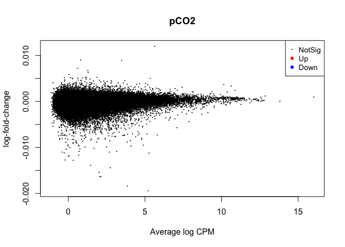
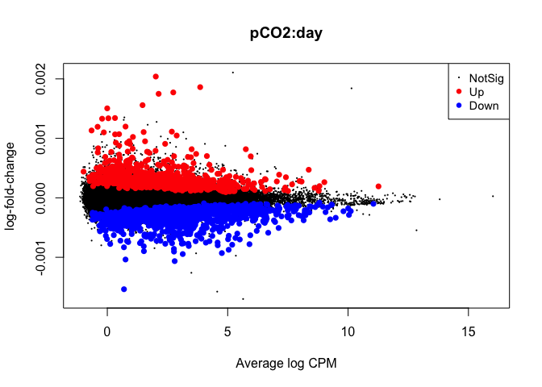
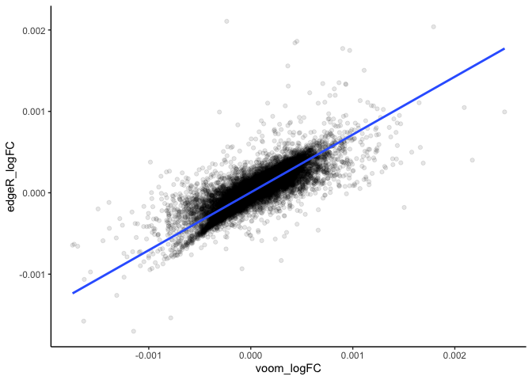
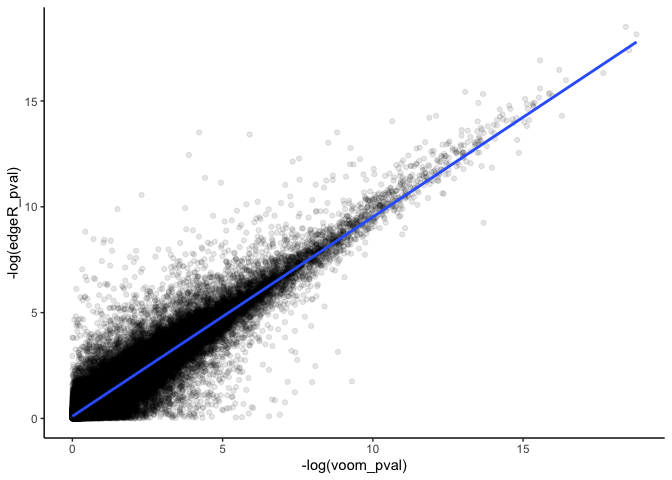

DGE\_comparison
================
Sam Bogan
8/1/2021

This markdown is a work in progress and walks through multifactorial modeling of gene expression using edgeR, DESeq2, limma-voom, EBSeq, and approaches for fitting models using customized code.

``` r
# Load packages
library( edgeR )
```

    ## Warning: package 'edgeR' was built under R version 3.6.2

    ## Loading required package: limma

    ## Warning: package 'limma' was built under R version 3.6.2

``` r
library( EBSeq )
```

    ## Loading required package: blockmodeling

    ## Warning: package 'blockmodeling' was built under R version 3.6.2

    ## To cite package 'blockmodeling' in publications please use package
    ## citation and (at least) one of the articles:
    ## 
    ##   Žiberna, Aleš (2007). Generalized blockmodeling of valued networks.
    ##   Social Networks 29(1), 105-126.
    ## 
    ##   Žiberna, Aleš (2008). Direct and indirect approaches to blockmodeling
    ##   of valued networks in terms of regular equivalence. Journal of
    ##   Mathematical Sociology 32(1), 57–84.
    ## 
    ##   Žiberna, Aleš (2014). Blockmodeling of multilevel networks. Social
    ##   Networks 39, 46–61. https://doi.org/10.1016/j.socnet.2014.04.002.
    ## 
    ##   Žiberna, Aleš (2020).  Generalized and Classical Blockmodeling of
    ##   Valued Networks, R package version 1.0.0.
    ## 
    ## To see these entries in BibTeX format, use 'print(<citation>,
    ## bibtex=TRUE)', 'toBibtex(.)', or set
    ## 'options(citation.bibtex.max=999)'.

    ## Loading required package: gplots

    ## Warning: package 'gplots' was built under R version 3.6.2

    ## 
    ## Attaching package: 'gplots'

    ## The following object is masked from 'package:stats':
    ## 
    ##     lowess

    ## Loading required package: testthat

    ## Warning: package 'testthat' was built under R version 3.6.2

``` r
library( tidyverse )
```

    ## Warning: package 'tidyverse' was built under R version 3.6.2

    ## ── Attaching packages ─────────────────────────────────────── tidyverse 1.3.1 ──

    ## ✓ ggplot2 3.3.3     ✓ purrr   0.3.4
    ## ✓ tibble  3.1.2     ✓ dplyr   1.0.6
    ## ✓ tidyr   1.1.3     ✓ stringr 1.4.0
    ## ✓ readr   1.4.0     ✓ forcats 0.5.1

    ## Warning: package 'ggplot2' was built under R version 3.6.2

    ## Warning: package 'tibble' was built under R version 3.6.2

    ## Warning: package 'tidyr' was built under R version 3.6.2

    ## Warning: package 'readr' was built under R version 3.6.2

    ## Warning: package 'purrr' was built under R version 3.6.2

    ## Warning: package 'dplyr' was built under R version 3.6.2

    ## Warning: package 'forcats' was built under R version 3.6.2

    ## ── Conflicts ────────────────────────────────────────── tidyverse_conflicts() ──
    ## x dplyr::filter()  masks stats::filter()
    ## x purrr::is_null() masks testthat::is_null()
    ## x dplyr::lag()     masks stats::lag()
    ## x dplyr::matches() masks tidyr::matches(), testthat::matches()
    ## x dplyr::recode()  masks blockmodeling::recode()

``` r
library( ape )
```

    ## Warning: package 'ape' was built under R version 3.6.2

``` r
library( vegan )
```

    ## Warning: package 'vegan' was built under R version 3.6.2

    ## Loading required package: permute

    ## Loading required package: lattice

    ## Warning: package 'lattice' was built under R version 3.6.2

    ## This is vegan 2.5-7

Read counts were produced by RSEM, mapped to a *de novo* transcriptome assembly for the Antarctic pteropod *Limacina helicina antarctica*.

# Features of Popular DGE packages

<table style="width:42%;">
<colgroup>
<col width="6%" />
<col width="6%" />
<col width="6%" />
<col width="6%" />
<col width="6%" />
<col width="6%" />
</colgroup>
<thead>
<tr class="header">
<th align="left">Program</th>
<th align="left">Distribution</th>
<th align="left">Dispersal</th>
<th align="left">Random eff.</th>
<th align="left">Continuous var.</th>
<th align="left">Interactive eff.</th>
</tr>
</thead>
<tbody>
<tr class="odd">
<td align="left">EBSeq</td>
<td align="left">Negative binomial</td>
<td align="left">x</td>
<td align="left">✖</td>
<td align="left">✖</td>
<td align="left">✖</td>
</tr>
<tr class="even">
<td align="left">edgeR</td>
<td align="left">Negative binomial</td>
<td align="left">Avg., empirical Bayes, tagwise, and trended options</td>
<td align="left">✔</td>
<td align="left">✔</td>
<td align="left">✔</td>
</tr>
<tr class="odd">
<td align="left">DESeq2</td>
<td align="left">Negative binomial</td>
<td align="left">x</td>
<td align="left">✔</td>
<td align="left">✔</td>
<td align="left">✔</td>
</tr>
<tr class="even">
<td align="left">limma-voom</td>
<td align="left">Mean-variance estimate</td>
<td align="left">Empirical Bayes smooth</td>
<td align="left">✔</td>
<td align="left">✔</td>
<td align="left">✔</td>
</tr>
</tbody>
</table>

# Filter and visualize read counts

``` r
# Read in matrix of RSEM expected read counts
data <- read.delim( "Input_data/expected_counts.matrix", sep = "\t", header = T, row.names = 1 )

# Peak at data to check that it looks okay
head( data )
```

    ##                   B7a.genes.results B7b.genes.results B7c.genes.results
    ## TR100110|c0_g1_i1              4.00             10.00              3.00
    ## TR101578|c0_g1_i1              0.00              0.00              0.00
    ## TR1047|c0_g1_i1               14.00             19.00             11.00
    ## TR105096|c0_g1_i1             14.00             12.00              9.00
    ## TR107626|c1_g1_i1           4530.93          28139.91          14141.83
    ## TR11301|c0_g1_i1               0.00              0.00              0.00
    ##                   B12a.genes.results B12b.genes.results B12c.genes.results
    ## TR100110|c0_g1_i1               6.00                9.0               8.00
    ## TR101578|c0_g1_i1               0.00                0.0               0.00
    ## TR1047|c0_g1_i1                15.00               14.0               9.00
    ## TR105096|c0_g1_i1              15.00                5.0              10.00
    ## TR107626|c1_g1_i1           80846.09             5649.4           30756.08
    ## TR11301|c0_g1_i1                0.00                0.0               0.00
    ##                   R7a.genes.results R7b.genes.results R7c.genes.results
    ## TR100110|c0_g1_i1              18.0             15.00              6.00
    ## TR101578|c0_g1_i1               0.0              0.00              0.00
    ## TR1047|c0_g1_i1                16.0             16.00             27.00
    ## TR105096|c0_g1_i1              25.0             15.00              6.00
    ## TR107626|c1_g1_i1          137592.5          45299.57          14843.47
    ## TR11301|c0_g1_i1                0.0              0.00              0.00
    ##                   R12a.genes.results R12b.genes.results R12c.genes.results
    ## TR100110|c0_g1_i1              11.00               13.0                  9
    ## TR101578|c0_g1_i1               0.00                0.0                  0
    ## TR1047|c0_g1_i1                23.00               14.0                 11
    ## TR105096|c0_g1_i1              14.00               45.0                 12
    ## TR107626|c1_g1_i1           21210.52           230436.5                  0
    ## TR11301|c0_g1_i1                0.00                0.0                  0
    ##                   Y7a.genes.results Y7b.genes.results Y7c.genes.results
    ## TR100110|c0_g1_i1                 6                 4              12.0
    ## TR101578|c0_g1_i1                 0                 0               0.0
    ## TR1047|c0_g1_i1                  20                 3              18.0
    ## TR105096|c0_g1_i1                 9                 1              13.0
    ## TR107626|c1_g1_i1                 0                 0          112214.6
    ## TR11301|c0_g1_i1                  0                 0               0.0
    ##                   Y12a.genes.results Y12b.genes.results Y12c.genes.results
    ## TR100110|c0_g1_i1              21.00                 12              12.00
    ## TR101578|c0_g1_i1               0.00                  0               0.00
    ## TR1047|c0_g1_i1                25.00                 14               9.00
    ## TR105096|c0_g1_i1              14.00                 19              24.00
    ## TR107626|c1_g1_i1           86243.14             148100           74153.54
    ## TR11301|c0_g1_i1                0.00                  0               0.00

``` r
# Name experimental samples: names correspond to pCO2 treatment (300, 600, 900) + days (12 h2 vs 7 days) + replicate ID
colnames( data ) <- c( "300.7.a", "300.7.b", "300.7.c","300.12.a", "300.12.b", "300.12.c", "600.7.a",
                       "900.7.b", "900.7.c", "900.12.a", "900.12.b", "900.12.c", "600.7.a", "600.7.b",
                       "600.7.c", "600.12.a", "600.12.b", "600.12.c")

# Create 'targets' and 'Group dataframe, expressing experimental variables for DEG analysis 
pCO2 <- as.numeric( c( 255, 255, 255, 255, 255, 255,
                       530, 530, 530, 530, 530, 530,
                       918, 918, 918, 918, 918, 918 ) )

treatment <- c( "B", "B", "B", "B", "B", "B",
                "R", "R", "R", "R", "R", "R",
                "Y", "Y", "Y", "Y", "Y", "Y" )

day <- as.numeric( c( 7, 7, 7, .5, .5, .5,
                      7, 7, 7, .5, .5, .5,
                      7, 7, 7, .5, .5, .5 ) )

targets <- data.frame( pCO2, day, treatment )
targets$grouping <- paste( targets$pCO2, targets$day, sep = "." )

Group <- factor( paste( targets$day, targets$pCO2, sep="_" ) )
cbind( targets, Group = Group )
```

    ##    pCO2 day treatment grouping   Group
    ## 1   255 7.0         B    255.7   7_255
    ## 2   255 7.0         B    255.7   7_255
    ## 3   255 7.0         B    255.7   7_255
    ## 4   255 0.5         B  255.0.5 0.5_255
    ## 5   255 0.5         B  255.0.5 0.5_255
    ## 6   255 0.5         B  255.0.5 0.5_255
    ## 7   530 7.0         R    530.7   7_530
    ## 8   530 7.0         R    530.7   7_530
    ## 9   530 7.0         R    530.7   7_530
    ## 10  530 0.5         R  530.0.5 0.5_530
    ## 11  530 0.5         R  530.0.5 0.5_530
    ## 12  530 0.5         R  530.0.5 0.5_530
    ## 13  918 7.0         Y    918.7   7_918
    ## 14  918 7.0         Y    918.7   7_918
    ## 15  918 7.0         Y    918.7   7_918
    ## 16  918 0.5         Y  918.0.5 0.5_918
    ## 17  918 0.5         Y  918.0.5 0.5_918
    ## 18  918 0.5         Y  918.0.5 0.5_918

``` r
# Data must be rounded to nearest integer in order to be fit for negative binomial distribution
data_input <- round( data )

# Peak at rounded data
head( data_input )
```

    ##                   300.7.a 300.7.b 300.7.c 300.12.a 300.12.b 300.12.c 600.7.a
    ## TR100110|c0_g1_i1       4      10       3        6        9        8      18
    ## TR101578|c0_g1_i1       0       0       0        0        0        0       0
    ## TR1047|c0_g1_i1        14      19      11       15       14        9      16
    ## TR105096|c0_g1_i1      14      12       9       15        5       10      25
    ## TR107626|c1_g1_i1    4531   28140   14142    80846     5649    30756  137592
    ## TR11301|c0_g1_i1        0       0       0        0        0        0       0
    ##                   900.7.b 900.7.c 900.12.a 900.12.b 900.12.c 600.7.a 600.7.b
    ## TR100110|c0_g1_i1      15       6       11       13        9       6       4
    ## TR101578|c0_g1_i1       0       0        0        0        0       0       0
    ## TR1047|c0_g1_i1        16      27       23       14       11      20       3
    ## TR105096|c0_g1_i1      15       6       14       45       12       9       1
    ## TR107626|c1_g1_i1   45300   14843    21211   230436        0       0       0
    ## TR11301|c0_g1_i1        0       0        0        0        0       0       0
    ##                   600.7.c 600.12.a 600.12.b 600.12.c
    ## TR100110|c0_g1_i1      12       21       12       12
    ## TR101578|c0_g1_i1       0        0        0        0
    ## TR1047|c0_g1_i1        18       25       14        9
    ## TR105096|c0_g1_i1      13       14       19       24
    ## TR107626|c1_g1_i1  112215    86243   148100    74154
    ## TR11301|c0_g1_i1        0        0        0        0

## MDS plot to visualizing mutliple factors

``` r
# Make a DGEList object for edgeR
y <- DGEList( counts = data_input, remove.zeros = TRUE )
```

    ## Repeated column names found in count matrix

    ## Removing 1761 rows with all zero counts

``` r
#Let's remove samples with less then 0.5 cpm (this is ~10 counts in the count file) in fewer then 9/12 samples
keep <- rowSums( cpm( y ) > .5 ) >= 9

table( keep )
```

    ## keep
    ## FALSE  TRUE 
    ## 18871 62579

``` r
# Set keep.lib.sizes = F and recalculate library sizes after filtering
y <- y[ keep, keep.lib.sizes = FALSE ]

y <- calcNormFactors( y )

# Calculate logCPM
df_log <- cpm( y, log = TRUE, prior.count = 2 )

# Plot MDS of filtered logCPM scores
N <- plotMDS( df_log )
```


``` r
# Hard to read right, right?

# Export pcoa loadings
dds.pcoa = pcoa( vegdist( t( df_log <- cpm( y, log = TRUE, prior.count = 2 ) ),
                          method = "euclidean") / 1000 )

# Create df of MDS vector loading
scores <- dds.pcoa$vectors

## Plot pcoa loadings of each sample, groouped by time point and pCO2 treatment

# Calculate % variation explained by each eigenvector
percent <- dds.pcoa$values$Eigenvalues
cumulative_percent_variance <- ( percent / sum( percent ) ) * 100

# Prepare information for pcoa plot, then plot
color <- c( "steelblue1", "tomato1", "goldenrod1")
par( mfrow = c( 1, 1 ) )
plot( scores[ , 1 ], scores[ , 2 ],
      cex=.5, cex.axis=1, cex.lab = 1.25,
      xlab = paste( "PC1, ", round( cumulative_percent_variance[ 1 ], 2 ), "%" ), 
      ylab = paste( "PC2, ", round( cumulative_percent_variance[ 2 ], 2 ), "%" ) )

# Add visual groupings to pcoa plot
ordihull( scores, as.factor(targets$treatment ), 
          border = NULL, lty = 2, lwd = .5, label = F,
          col = color, draw = "polygon", alpha = 100, cex = .5 )

ordispider( scores,as.factor( targets$grouping ),label = F ) # Vectors connecting samples in same pCO2 x time group

ordilabel( scores, cex = 0.5) # Label sample IDs
```


``` r
logCPM.pca <- prcomp( t ( df_log ) )
logCPM.pca.proportionvariances <- ( ( logCPM.pca$sdev ^ 2 ) / ( sum( logCPM.pca$sdev ^ 2 ) ) ) * 100


## Do treatment groups fully segregate? Wrap samples by pCO2 x time, not just pCO2
# Replot using logCPM.pca
plot( logCPM.pca$x, type = "n", main = NA, xlab = paste( "PC1, ", round( logCPM.pca.proportionvariances[ 1 ], 2 ), "%" ), ylab = paste( "PC2, ", round( logCPM.pca.proportionvariances[ 2 ], 2 ), "%" ) )

points( logCPM.pca$x, col = "black", pch = 16, cex = 1 )
colors2 <- c( "steelblue1", "dodgerblue2", "tomato1", "coral", "goldenrod1", "goldenrod3" )

ordihull( logCPM.pca$x, targets$grouping, 
          border = NULL, lty = 2, lwd = .5, 
          col = colors2, draw = "polygon", 
          alpha = 75,cex = .5, label = T )
```



## Interactive effects: edgeR

``` r
# Fit multifactoria design matrix
design_multi <- model.matrix( ~1 + pCO2 + pCO2:day ) #Generate multivariate edgeR glm

# Ensure that design matrix looks correct
colnames( design_multi )
```

    ## [1] "(Intercept)" "pCO2"        "pCO2:day"

``` r
# Estimate dispersion coefficients
y1 <- estimateDisp( y, robust = TRUE ) # Estimate mean dispersal
```

    ## Design matrix not provided. Switch to the classic mode.

``` r
# Plot tagwise dispersal and impose w/ mean dispersal and trendline
plotBCV( y1 ) 
```


``` r
# Fit quasi-likelihood, neg binom linear regression
multi_fit <- glmQLFit( y1, design_multi ) # Fit multivariate model to counts
plotQLDisp( multi_fit, col.shrunk = "red", col.raw = "black", col.trend = NULL )
```


``` r
# Test for effect of pCO2
tr_pCO2 <- glmQLFTest( multi_fit, coef = 2, contrast = NULL, poisson.bound = FALSE ) # Estimate significant DEGs

is.de_tr_pCO2 <- decideTestsDGE( tr_pCO2, adjust.method = "fdr", p.value = 0.05 ) # Make contrasts

summary( is.de_tr_pCO2 )
```

    ##         pCO2
    ## Down       0
    ## NotSig 62579
    ## Up         0

``` r
plotMD( tr_pCO2 )
```


``` r
# Interaction
tr_int <- glmQLFTest( multi_fit, coef = 3, poisson.bound = FALSE ) # Estimate significant DEGs

is.de_int <- decideTestsDGE( tr_int, adjust.method = "fdr", p.value = 0.05 ) # Make contrasts

summary( is.de_int )
```

    ##        pCO2:day
    ## Down       1021
    ## NotSig    60821
    ## Up          737

``` r
plotMD( tr_int )
```



## Interactive effects: limma-voom

``` r
# Perform voom transformation
voom <- voom( y, design_multi, plot = T )
```


``` r
# Fit using voom
lm_voom_fit <- lmFit( voom, design_multi )

# Create a contrast across continuous pCO2 variable
cont_pCO2 <- contrasts.fit( lm_voom_fit, coef = "pCO2" )

# Create a contrast across interaction etween continuous pCO2 and time variables
cont_pCO2_day <- contrasts.fit( lm_voom_fit, coef = "pCO2:day" )

# Perform empirical Bayes smoothing of standard errors
lm_voom_fit <- eBayes( lm_voom_fit )

# Output test statistics
pCO2_results <- topTable( lm_voom_fit, coef = "pCO2", adjust.method="fdr", n = Inf )
pCO2_day_results <- topTable( lm_voom_fit, coef = "pCO2:day", adjust.method="fdr", n = Inf )

# How many DEG are associated with pCO2 and pCO2:day?
length( which( pCO2_results$adj.P.Val < 0.05 & abs( pCO2_results$logFC ) > ( 4 / 600 ) ) ) # number of DE genes = 7091
```

    ## [1] 0

``` r
length( which( pCO2_results$adj.P.Val < 0.05  ) ) # number of DE genes
```

    ## [1] 0

``` r
length( which( pCO2_day_results$adj.P.Val < 0.05 & 
                 abs( pCO2_day_results$logFC ) > ( 4 / 600 ) ) ) # number of DE genes = 7091
```

    ## [1] 0

``` r
length( which( pCO2_day_results$adj.P.Val < 0.05  ) ) # number of DE genes
```

    ## [1] 1628

## Interactive effects: limma-voom

## Comparing test statistics: interactive effects

``` r
voom_edgeR_int_comp <- merge( data.frame( geneid = row.names( pCO2_day_results ),
                                          voom_logFC = pCO2_day_results$logFC,
                                          voom_pval = pCO2_day_results$P.Value ),
                              data.frame( geneid = row.names( tr_int$table ),
                                          edgeR_logFC = tr_int$table$logFC,
                                          edgeR_pval = tr_int$table$PValue ),
                              by = "geneid" )

# Correlation of logFC
ggplot( data = voom_edgeR_int_comp,
        aes( x = voom_logFC, y = edgeR_logFC ) ) +
  geom_point( alpha = 0.1 ) +
  geom_smooth( method = "lm" ) +
  theme_classic()
```

    ## `geom_smooth()` using formula 'y ~ x'



``` r
# Correlation of logFC
ggplot( data = voom_edgeR_int_comp,
        aes( x = -log( voom_pval ), y = -log( edgeR_pval ) ) ) +
  geom_point( alpha = 0.1 ) +
  geom_smooth( method = "lm" ) +
  theme_classic()
```

    ## `geom_smooth()` using formula 'y ~ x'


