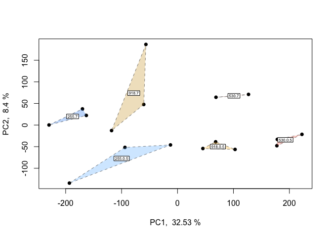
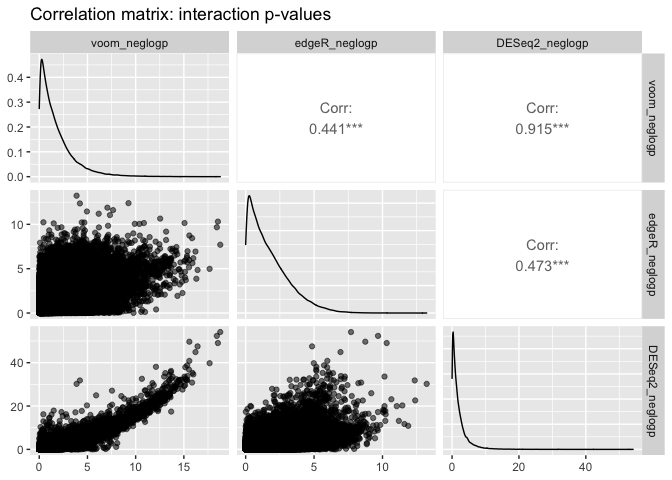

DGE\_comparison
================
Sam Bogan
8/1/2021

# Intro to multifactorial RNA-seq models

          Studies of molecular responses to environmental change increasingly employ multifactorial experimental designs incorporating multiple developmental stages, stressors, populations, or non-linear dynamics that resolve interactions which shape expression, physiology, and performance. However, it can be difficult to navigate what functionality popular differential expression (DE) packages have for fitting multivariate models. Additionally, most packages do not have the flexibility to accomodate a number of common experimental design components. Regardless of whether you have RNA-seq data on hand or you're in the process of planning your experiment, this walkthrough will help you navigate what DE packages and model fitting approaches are best suited to your experimental design.

## Variables we will cover

          This walkthrough can be broken down into different types of predictor variables that can be incoporated in models of expression. In the order we address them, these are:

-   Continuous fixed effects
-   Interactive fixed effects
-   Random intercepts
-   Random slopes
-   Random effects for non-independence (e.g., sample relatedness)
-   Non-linear fixed effects

## Packages we will cover

          We conclude this walkthrough by providing examples of in-house scripts for modelling expression and quantifying DE that provide more flexibility for fitting complex multivariate designs. The packages that we cover are:

-   baySeq (Hardcastle & Kelly, 2010)
-   DESeq2 (Love, Huber, & Anders, 2014)
-   EBSeq (Leng et al., 2013)
-   edgeR (Robinson, McCarthy, & Smyth, 2010)
-   Voom (often called Limma-Voom) (Law, Chen, Shi, & Smyth, 2014)

## Summary of approach

          We will walk you through (i) how to conduct essential checks of your data such as principle components analysis and observing the distribution of filtered read counts, (ii) evaluating each package's functionality for multifactorial model fitting, and (iii) how to fit each type of predictor by performing differential expression tests using real data. These data come from an experiment that exposed the Anatarctic pteropod (a free-swimming planktonic snail) *Limacina helicina antarctica* to three continuous levels of ocean acidification (OA) for either 0.5 or 7 days. These RNA-seq counts are derived from reads mapped and counted via RSEM (Li & Dewey, 2011) using a *de novo* reference transcriptome assembled by Johnson & Hofmann (2016).

``` r
# Load packages
library( DESeq2 )
library( edgeR )
library( EBSeq )
library( tidyverse )
library( ape )
library( vegan )
library( GGally )
library( arrayQualityMetrics )
library( rgl )
library( dplyr )
library( adegenet )
```

# Features of popular DGE packages

<table style="width:42%;">
<colgroup>
<col width="6%" />
<col width="6%" />
<col width="6%" />
<col width="6%" />
<col width="6%" />
<col width="6%" />
</colgroup>
<thead>
<tr class="header">
<th align="left">Program</th>
<th align="left">Distribution</th>
<th align="left">Dispersal</th>
<th align="left">Random eff.</th>
<th align="left">Continuous var.</th>
<th align="left">Interactive eff.</th>
</tr>
</thead>
<tbody>
<tr class="odd">
<td align="left">EBSeq</td>
<td align="left">Negative binomial</td>
<td align="left">?</td>
<td align="left">✖</td>
<td align="left">✖</td>
<td align="left">✖</td>
</tr>
<tr class="even">
<td align="left">edgeR</td>
<td align="left">Negative binomial</td>
<td align="left">Avg., trended, tagwise, and Bayesian shrinkage options</td>
<td align="left">✔</td>
<td align="left">✔</td>
<td align="left">✔</td>
</tr>
<tr class="odd">
<td align="left">DESeq2</td>
<td align="left">Negative binomial</td>
<td align="left">Avg., trended, tagwise, and shrinkage options,</td>
<td align="left">✔</td>
<td align="left">✔</td>
<td align="left">✔</td>
</tr>
<tr class="even">
<td align="left">limma-voom</td>
<td align="left">Mean-variance estimate</td>
<td align="left">Empirical Bayes smooth</td>
<td align="left">✔</td>
<td align="left">✔</td>
<td align="left">✔</td>
</tr>
</tbody>
</table>

Read counts were produced by RSEM, mapped to a *de novo* transcriptome assembly for the Antarctic pteropod *Limacina helicina antarctica*.

# Filter and visualize read counts

``` r
# Read in matrix of RSEM expected read counts
data <- read.delim( "Input_data/expected_counts.matrix", sep = "\t", header = T, row.names = 1 )

# Peak at data to check that it looks okay
head( data )
```

    ##                   B7a.genes.results B7b.genes.results B7c.genes.results
    ## TR100110|c0_g1_i1              4.00             10.00              3.00
    ## TR101578|c0_g1_i1              0.00              0.00              0.00
    ## TR1047|c0_g1_i1               14.00             19.00             11.00
    ## TR105096|c0_g1_i1             14.00             12.00              9.00
    ## TR107626|c1_g1_i1           4530.93          28139.91          14141.83
    ## TR11301|c0_g1_i1               0.00              0.00              0.00
    ##                   B12a.genes.results B12b.genes.results B12c.genes.results
    ## TR100110|c0_g1_i1               6.00                9.0               8.00
    ## TR101578|c0_g1_i1               0.00                0.0               0.00
    ## TR1047|c0_g1_i1                15.00               14.0               9.00
    ## TR105096|c0_g1_i1              15.00                5.0              10.00
    ## TR107626|c1_g1_i1           80846.09             5649.4           30756.08
    ## TR11301|c0_g1_i1                0.00                0.0               0.00
    ##                   R7a.genes.results R7b.genes.results R7c.genes.results
    ## TR100110|c0_g1_i1              18.0             15.00              6.00
    ## TR101578|c0_g1_i1               0.0              0.00              0.00
    ## TR1047|c0_g1_i1                16.0             16.00             27.00
    ## TR105096|c0_g1_i1              25.0             15.00              6.00
    ## TR107626|c1_g1_i1          137592.5          45299.57          14843.47
    ## TR11301|c0_g1_i1                0.0              0.00              0.00
    ##                   R12a.genes.results R12b.genes.results R12c.genes.results
    ## TR100110|c0_g1_i1              11.00               13.0                  9
    ## TR101578|c0_g1_i1               0.00                0.0                  0
    ## TR1047|c0_g1_i1                23.00               14.0                 11
    ## TR105096|c0_g1_i1              14.00               45.0                 12
    ## TR107626|c1_g1_i1           21210.52           230436.5                  0
    ## TR11301|c0_g1_i1                0.00                0.0                  0
    ##                   Y7a.genes.results Y7b.genes.results Y7c.genes.results
    ## TR100110|c0_g1_i1                 6                 4              12.0
    ## TR101578|c0_g1_i1                 0                 0               0.0
    ## TR1047|c0_g1_i1                  20                 3              18.0
    ## TR105096|c0_g1_i1                 9                 1              13.0
    ## TR107626|c1_g1_i1                 0                 0          112214.6
    ## TR11301|c0_g1_i1                  0                 0               0.0
    ##                   Y12a.genes.results Y12b.genes.results Y12c.genes.results
    ## TR100110|c0_g1_i1              21.00                 12              12.00
    ## TR101578|c0_g1_i1               0.00                  0               0.00
    ## TR1047|c0_g1_i1                25.00                 14               9.00
    ## TR105096|c0_g1_i1              14.00                 19              24.00
    ## TR107626|c1_g1_i1           86243.14             148100           74153.54
    ## TR11301|c0_g1_i1                0.00                  0               0.00

``` r
# Name experimental samples: names correspond to pCO2 treatment (300, 600, 900) + days (12 h2 vs 7 days) + replicate ID
colnames( data ) <- c( "300.7.a", "300.7.b", "300.7.c","300.12.a", "300.12.b", "300.12.c", "600.7.a",
                       "900.7.b", "900.7.c", "900.12.a", "900.12.b", "900.12.c", "600.7.a", "600.7.b",
                       "600.7.c", "600.12.a", "600.12.b", "600.12.c")

# Create 'targets' and 'Group dataframe, expressing experimental variables for DEG analysis 
pCO2 <- as.numeric( c( 255, 255, 255, 255, 255, 255,
                       530, 530, 530, 530, 530, 530,
                       918, 918, 918, 918, 918, 918 ) )

treatment <- c( "B", "B", "B", "B", "B", "B",
                "R", "R", "R", "R", "R", "R",
                "Y", "Y", "Y", "Y", "Y", "Y" )

day <- as.numeric( c( 7, 7, 7, .5, .5, .5,
                      7, 7, 7, .5, .5, .5,
                      7, 7, 7, .5, .5, .5 ) )

targets <- data.frame( pCO2, day, treatment )
targets$grouping <- paste( targets$pCO2, targets$day, sep = "." )

Group <- factor( paste( targets$day, targets$pCO2, sep = "_" ) )
cbind( targets, Group = Group )
```

    ##    pCO2 day treatment grouping   Group
    ## 1   255 7.0         B    255.7   7_255
    ## 2   255 7.0         B    255.7   7_255
    ## 3   255 7.0         B    255.7   7_255
    ## 4   255 0.5         B  255.0.5 0.5_255
    ## 5   255 0.5         B  255.0.5 0.5_255
    ## 6   255 0.5         B  255.0.5 0.5_255
    ## 7   530 7.0         R    530.7   7_530
    ## 8   530 7.0         R    530.7   7_530
    ## 9   530 7.0         R    530.7   7_530
    ## 10  530 0.5         R  530.0.5 0.5_530
    ## 11  530 0.5         R  530.0.5 0.5_530
    ## 12  530 0.5         R  530.0.5 0.5_530
    ## 13  918 7.0         Y    918.7   7_918
    ## 14  918 7.0         Y    918.7   7_918
    ## 15  918 7.0         Y    918.7   7_918
    ## 16  918 0.5         Y  918.0.5 0.5_918
    ## 17  918 0.5         Y  918.0.5 0.5_918
    ## 18  918 0.5         Y  918.0.5 0.5_918

``` r
# Data must be rounded to nearest integer in order to be fit for negative binomial distribution
data_input <- round( data )

# Peak at rounded data
head( data_input )
```

    ##                   300.7.a 300.7.b 300.7.c 300.12.a 300.12.b 300.12.c 600.7.a
    ## TR100110|c0_g1_i1       4      10       3        6        9        8      18
    ## TR101578|c0_g1_i1       0       0       0        0        0        0       0
    ## TR1047|c0_g1_i1        14      19      11       15       14        9      16
    ## TR105096|c0_g1_i1      14      12       9       15        5       10      25
    ## TR107626|c1_g1_i1    4531   28140   14142    80846     5649    30756  137592
    ## TR11301|c0_g1_i1        0       0       0        0        0        0       0
    ##                   900.7.b 900.7.c 900.12.a 900.12.b 900.12.c 600.7.a 600.7.b
    ## TR100110|c0_g1_i1      15       6       11       13        9       6       4
    ## TR101578|c0_g1_i1       0       0        0        0        0       0       0
    ## TR1047|c0_g1_i1        16      27       23       14       11      20       3
    ## TR105096|c0_g1_i1      15       6       14       45       12       9       1
    ## TR107626|c1_g1_i1   45300   14843    21211   230436        0       0       0
    ## TR11301|c0_g1_i1        0       0        0        0        0       0       0
    ##                   600.7.c 600.12.a 600.12.b 600.12.c
    ## TR100110|c0_g1_i1      12       21       12       12
    ## TR101578|c0_g1_i1       0        0        0        0
    ## TR1047|c0_g1_i1        18       25       14        9
    ## TR105096|c0_g1_i1      13       14       19       24
    ## TR107626|c1_g1_i1  112215    86243   148100    74154
    ## TR11301|c0_g1_i1        0        0        0        0

``` r
# Plot distribution of unfiltered read counts across all samples 
ggplot( data = data.frame( rowMeans( data_input ) ),
        aes( x = rowMeans.data_input. ) ) +
  geom_density( fill = "grey" ) +
  xlim( 0, 500 ) +
  theme_classic() +
  labs( title = "Distribution of unfiltered reads" ) +
  labs( y = "Density", x = "Unfiltered read counts", title = "Read count distribution" )
```


## MDS plot visualizing mutliple factors

          Before analyzing our data, it is essential that we look at the multivariate relationships between our samples based on transcriptome-wide expression levels. Below is example code and output for a principle coordinates analysis (PCOA) plot that visualizes multifactorial RNA-seq replicates according to two predictor variables across major and minor latent variables or PCOA axes. These predictor variables, as discussed above, are *p*CO**<sub>2</sub> and time-in-treatment.

``` r
# Make a DGEList object for edgeR
y <- DGEList( counts = data_input, remove.zeros = TRUE )

#Let's remove samples with less then 0.5 cpm (this is ~10 counts in the count file) in fewer then 9/12 samples
keep <- rowSums( cpm( y ) > .5 ) >= 9

table( keep )
```

    ## keep
    ## FALSE  TRUE 
    ## 18871 62579

``` r
# Set keep.lib.sizes = F and recalculate library sizes after filtering
y <- y[ keep, keep.lib.sizes = FALSE ]

y <- calcNormFactors( y )

# Calculate logCPM
df_log <- cpm( y, log = TRUE, prior.count = 2 )

# Export pcoa loadings
dds.pcoa = pcoa( vegdist( t( df_log <- cpm( y, log = TRUE, prior.count = 2 ) ),
                          method = "euclidean") / 1000 )

# Create df of MDS vector loading
scores <- dds.pcoa$vectors

## Plot pcoa loadings of each sample, groouped by time point and pCO2 treatment

# Calculate % variation explained by each eigenvector
percent <- dds.pcoa$values$Eigenvalues
cumulative_percent_variance <- ( percent / sum( percent ) ) * 100

# Prepare information for pcoa plot, then plot
color <- c( "steelblue1", "tomato1", "goldenrod1")
par( mfrow = c( 1, 1 ) )
plot( scores[ , 1 ], scores[ , 2 ],
      cex=.5, cex.axis=1, cex.lab = 1.25,
      xlab = paste( "PC1, ", round( cumulative_percent_variance[ 1 ], 2 ), "%" ), 
      ylab = paste( "PC2, ", round( cumulative_percent_variance[ 2 ], 2 ), "%" ) )

# Add visual groupings to pcoa plot
ordihull( scores, as.factor(targets$treatment ), 
          border = NULL, lty = 2, lwd = .5, label = F,
          col = color, draw = "polygon", alpha = 100, cex = .5 )

ordispider( scores,as.factor( targets$grouping ),label = F ) # Vectors connecting samples in same pCO2 x time group

ordilabel( scores, cex = 0.5) # Label sample IDs
```


``` r
logCPM.pca <- prcomp( t ( df_log ) )
logCPM.pca.proportionvariances <- ( ( logCPM.pca$sdev ^ 2 ) / ( sum( logCPM.pca$sdev ^ 2 ) ) ) * 100


## Do treatment groups fully segregate? Wrap samples by pCO2 x time, not just pCO2
# Replot using logCPM.pca
plot( logCPM.pca$x, type = "n", main = NA, xlab = paste( "PC1, ", round( logCPM.pca.proportionvariances[ 1 ], 2 ), "%" ), ylab = paste( "PC2, ", round( logCPM.pca.proportionvariances[ 2 ], 2 ), "%" ) )

points( logCPM.pca$x, col = "black", pch = 16, cex = 1 )
colors2 <- c( "steelblue1", "dodgerblue2", "tomato1", "coral", "goldenrod1", "goldenrod3" )

ordihull( logCPM.pca$x, targets$grouping, 
          border = NULL, lty = 2, lwd = .5, 
          col = colors2, draw = "polygon", 
          alpha = 75,cex = .5, label = T )
```



          From this PCOA, we can see that treatment and time both influence multivariate gene expression across the RNA-seq samples. By and large, samples also cluster according to these two predictors in a manner consistent with what we would expect from our experimental design. After conducting QC analyses and plots of the read count data, it is time to begin model fitting and testing for differential expression.

# Interactive effects

        Interactive effects shaping gene expression are common in nature and are becoming increasingly prevalent in models of gene expression derived from experimental studies. Below, we outline methods for fitting intereactive effects using categorical and continuous variables in models of expression. We provide examples in edgeR, DESeq2, and Voom before comparing correlations between these programs' fold change (logFC) predictions and test statistics.

## Interactive effects: edgeR

``` r
# Fit multifactoria design matrix
design_multi <- model.matrix( ~1 + pCO2 + pCO2:day ) #Generate multivariate edgeR glm

# Ensure that design matrix looks correct
colnames( design_multi )
```

    ## [1] "(Intercept)" "pCO2"        "pCO2:day"

``` r
# Estimate dispersion coefficients
y1 <- estimateDisp( y, robust = TRUE ) # Estimate mean dispersal
```

    ## Design matrix not provided. Switch to the classic mode.

``` r
# Plot tagwise dispersal and impose w/ mean dispersal and trendline
plotBCV( y1 ) 
```


``` r
# Fit quasi-likelihood, neg binom linear regression
multi_fit <- glmQLFit( y1, design_multi ) # Fit multivariate model to counts
plotQLDisp( multi_fit, col.shrunk = "red", col.raw = "black", col.trend = NULL )
```


``` r
# Test for effect of pCO2
tr_pCO2 <- glmQLFTest( multi_fit, coef = 2, contrast = NULL, poisson.bound = FALSE ) # Estimate significant DEGs

is.de_tr_pCO2 <- decideTestsDGE( tr_pCO2, adjust.method = "fdr", p.value = 0.05 ) # Make contrasts

summary( is.de_tr_pCO2 )
```

    ##         pCO2
    ## Down       0
    ## NotSig 62579
    ## Up         0

``` r
plotMD( tr_pCO2 )

# Interaction
tr_int <- glmQLFTest( multi_fit, coef = 2, poisson.bound = FALSE ) # Estimate significant DEGs

is.de_int <- decideTestsDGE( tr_int, adjust.method = "fdr", p.value = 0.05 ) # Make contrasts

summary( is.de_int )
```

    ##         pCO2
    ## Down       0
    ## NotSig 62579
    ## Up         0

``` r
plotMD( tr_int )
```


``` r
# Check residuals
edgeR_res <- residuals( multi_fit, type = "pearson" )
head( edgeR_res )
```

    ## NULL

## Interactive effects: limma-voom

``` r
# Perform voom transformation
voom <- voom( y, design_multi, plot = T )
```


``` r
# Fit using voom
lm_voom_fit <- lmFit( voom, design_multi )

# Create a contrast across continuous pCO2 variable
cont_pCO2 <- contrasts.fit( lm_voom_fit, coef = "pCO2" )

# Create a contrast across interaction etween continuous pCO2 and time variables
cont_pCO2_day <- contrasts.fit( lm_voom_fit, coef = "pCO2:day" )

# Perform empirical Bayes smoothing of standard errors
lm_voom_fit <- eBayes( lm_voom_fit )

# Output test statistics
pCO2_results <- topTable( lm_voom_fit, coef = "pCO2", adjust.method="fdr", n = Inf )
pCO2_day_results <- topTable( lm_voom_fit, coef = "pCO2:day", adjust.method="fdr", n = Inf )

# How many DEG are associated with pCO2 and pCO2:day?
length( which( pCO2_results$adj.P.Val < 0.05 & abs( pCO2_results$logFC ) > ( 4 / 600 ) ) ) # number of DE genes = 7091
```

    ## [1] 0

``` r
length( which( pCO2_results$adj.P.Val < 0.05  ) ) # number of DE genes
```

    ## [1] 0

``` r
length( which( pCO2_day_results$adj.P.Val < 0.05 & 
                 abs( pCO2_day_results$logFC ) > ( 4 / 600 ) ) ) # number of DE genes = 7091
```

    ## [1] 0

``` r
length( which( pCO2_day_results$adj.P.Val < 0.05  ) ) # number of DE genes
```

    ## [1] 1628

## Interactive effects: DESeq2

In this current draft, it appears that fitting the interaction term ~ pCO2:day ONLY, rather than adding pCO2 + day + ..., results in the strongest correlations with voom and edgeR interaction stats. I am currently figuring out why this is.

As such, the DESeq2 code below only fits the interaction term to the read count data.

    ## Repeated column names found in count matrix

    ## Removing 1761 rows with all zero counts

    ## keep_g
    ## FALSE  TRUE 
    ## 20632 62579

    ##    pCO2 day treatment grouping
    ## 1   255 7.0         B    255.7
    ## 2   255 7.0         B    255.7
    ## 3   255 7.0         B    255.7
    ## 4   255 0.5         B  255.0.5
    ## 5   255 0.5         B  255.0.5
    ## 6   255 0.5         B  255.0.5
    ## 7   530 7.0         R    530.7
    ## 8   530 7.0         R    530.7
    ## 9   530 7.0         R    530.7
    ## 10  530 0.5         R  530.0.5
    ## 11  530 0.5         R  530.0.5
    ## 12  530 0.5         R  530.0.5
    ## 13  918 7.0         Y    918.7
    ## 14  918 7.0         Y    918.7
    ## 15  918 7.0         Y    918.7
    ## 16  918 0.5         Y  918.0.5
    ## 17  918 0.5         Y  918.0.5
    ## 18  918 0.5         Y  918.0.5

    ## converting counts to integer mode

    ##   the design formula contains one or more numeric variables with integer values,
    ##   specifying a model with increasing fold change for higher values.
    ##   did you mean for this to be a factor? if so, first convert
    ##   this variable to a factor using the factor() function

    ##   the design formula contains one or more numeric variables that have mean or
    ##   standard deviation larger than 5 (an arbitrary threshold to trigger this message).
    ##   it is generally a good idea to center and scale numeric variables in the design
    ##   to improve GLM convergence.

    ## estimating size factors

    ## estimating dispersions

    ## gene-wise dispersion estimates

    ## mean-dispersion relationship

    ## final dispersion estimates

    ## fitting model and testing

## Comparing test statistics: interactive effects

``` r
# Merge logFC and pval data from each program
voom_edgeR_deseq_int_comp <- merge( 
  merge(
    data.frame( geneid = row.names( pCO2_day_results ),
                voom_logFC = pCO2_day_results$logFC,
                voom_pval = pCO2_day_results$P.Value ),
    data.frame( geneid = row.names( tr_int$table ),
                edgeR_logFC = -( tr_int$table$logFC ), #negate logFC because of syntax differences
                edgeR_pval = tr_int$table$PValue ), 
    by = "geneid" ),
  data.frame( geneid = row.names( DESeq2_int_results ),
              DESeq2_logFC = DESeq2_int_results$log2FoldChange,
              DESeq2_pval = DESeq2_int_results$pvalue ),
  by = "geneid" )

# Create neg log pvalues
voom_edgeR_deseq_int_comp$voom_neglogp <- -log( voom_edgeR_deseq_int_comp$voom_pval )
voom_edgeR_deseq_int_comp$edgeR_neglogp <- -log( voom_edgeR_deseq_int_comp$edgeR_pval )
voom_edgeR_deseq_int_comp$DESeq2_neglogp <- -log( voom_edgeR_deseq_int_comp$DESeq2_pval )

# Correlation matrix of pvalues
pval_pairs <- ggpairs( data = voom_edgeR_deseq_int_comp,
                       columns = c( 8, 9, 10 ),
                       mapping = aes( alpha = 0.001 ) ) +
  labs( title = "Correlation matrix: interaction p-values" )

pval_pairs
```



``` r
# Create neg log pvalues
voom_edgeR_deseq_int_comp$voom_neglogp <- -log( voom_edgeR_deseq_int_comp$voom_pval )
voom_edgeR_deseq_int_comp$edgeR_neglogp <- -log( voom_edgeR_deseq_int_comp$edgeR_pval )
voom_edgeR_deseq_int_comp$DESeq2_neglogp <- -log( voom_edgeR_deseq_int_comp$DESeq2_pval )

# Correlation matrix of logFC's
logFC_pairs <- ggpairs( data = voom_edgeR_deseq_int_comp,
                       columns = c( 2, 4, 6 ),
                       mapping = aes( alpha = 0.001 ) ) +
  labs( title = "Correlation matrix: interaction logFC's" )

logFC_pairs
```


``` r
# Correlation of logFC
ggplot( data = voom_edgeR_deseq_int_comp,
        aes( x = voom_logFC, y = edgeR_logFC ) ) +
  geom_hex( bins = 100,
            aes(fill = stat( log( count ) ) ) ) +
  theme_classic() +
  scale_fill_viridis_c() +
  geom_smooth( method = "lm", color = "red", lty = 2 ) +
  labs( title = "Interactions: edgeR vs. limma-voom logFC's", 
        x = "limma-voom logFC",
        y = "edgeR logFC" )
```


``` r
# Correlations between pvals
ggplot( data = voom_edgeR_deseq_int_comp,
        aes( x = -log( voom_pval ), y = -log( edgeR_pval ) ) ) +
  geom_hex( bins = 100,
            aes(fill = stat( log( count ) ) ) ) +
  theme_classic() +
  scale_fill_viridis_c() +
  geom_smooth( method = "lm", color = "red", lty = 2 ) +
  labs( title = "Interactions: edgeR vs. limma-voom p-values", 
        x = "limma-voom pval",
        y = "edgeR pval" )
```


``` r
# Correlation of logFC: edgeR vs DESeq2 
ggplot( data = voom_edgeR_deseq_int_comp,
        aes( x = DESeq2_logFC, y = edgeR_logFC ) ) +
  geom_hex( bins = 100,
            aes(fill = stat( log( count ) ) ) ) +
  theme_classic() +
  scale_fill_viridis_c() +
  geom_smooth( method = "lm", color = "red", lty = 2 ) +
  labs( title = "Interactions: edgeR vs. DESeq2 logFC's", 
        x = "DESeq2 logFC",
        y = "edgeR logFC" )
```


``` r
# Correlation of logFC: edgeR vs DESeq2 
ggplot( data = voom_edgeR_deseq_int_comp,
        aes( x = -log( DESeq2_pval ), y = -log( edgeR_pval ) ) ) +
  geom_hex( bins = 100,
            aes(fill = stat( log( count ) ) ) ) +
  xlim( values = c( 0, 20 ) ) +
  theme_classic() +
  scale_fill_viridis_c() +
  geom_smooth( method = "lm", color = "red", lty = 2 ) +
  labs( title = "Interactions: edgeR vs. DESeq2 p-values", 
        x = "DESeq2 logFC",
        y = "edgeR logFC" )
```


# Random Effects: voom

We will skip edgeR and DESeq2 since they cannot fit random effects

``` r
# Fit multifactoria design matrix
design_rand <- model.matrix( ~1 + pCO2 + ( 1 | day ) ) #Generate multivariate edgeR glm

# Perform voom transformation
voom_rand <- voom( y, design_rand, plot = T )
```

    ## Coefficients not estimable: 1 | dayTRUE

    ## Warning: Partial NA coefficients for 81450 probe(s)


``` r
# Fit using voom
lm_voom_fit_rand <- lmFit( voom_rand, design_rand )
```

    ## Coefficients not estimable: 1 | dayTRUE

    ## Warning: Partial NA coefficients for 81450 probe(s)

``` r
# Create a contrast across continuous pCO2 variable
cont_rand_day <- contrasts.fit( lm_voom_fit_rand, coef = "pCO2" )

# Perform empirical Bayes smoothing of standard errors
lm_voom_fit_rand <- eBayes( lm_voom_fit_rand )
```

    ## Warning in .ebayes(fit = fit, proportion = proportion, stdev.coef.lim =
    ## stdev.coef.lim, : Estimation of var.prior failed - set to default value

``` r
# Output test statistics
rand_results <- topTable( lm_voom_fit_rand, coef = "pCO2", adjust.method = "fdr", n = Inf )

# How many DEG are associated with pCO2 and pCO2:day?
length( which( rand_results$adj.P.Val < 0.05 & abs( rand_results$logFC ) > ( 4 / 600 ) ) ) # number of DE genes = 7091
```

    ## [1] 3

``` r
length( which( rand_results$adj.P.Val < 0.05  ) ) # number of DE genes
```

    ## [1] 3

``` r
length( which( rand_results$adj.P.Val < 0.05 & 
                 abs( rand_results$logFC ) > ( 4 / 600 ) ) ) # number of DE genes = 7091
```

    ## [1] 3

``` r
length( which( rand_results$adj.P.Val < 0.05  ) ) # number of DE genes
```

    ## [1] 3

Random slopes: to our knowledge, no DESeq package permits the fitting of random slopes

What we want to test whether the effect of *p*CO**<sub>2</sub> on expression varies by time, treating time as a random effect with different intercepts but a parameter?

# GO enrichment

Gene ontology (GO) are broad categories of gene function and processes that can help reveal higher level patterns in gene expression (and other data). To perfom this analysis you will need an annotation file that maps your transcripts to their appropriate GO annotations. Several programs are avaiable for GO enrichment analyses. We will cover a versatile option: GO MWU (Man-Whitney Un-ranked) which uses a simple ranking analyses to determine if certain GO categories are over represented among a list of ranked gene. These can be ranked based on log-fold change or p values, as well as a few other variable such as WGCNA eigen-gene module membership strength. See below for a description of WGCNA and its uses.

## GO\_MWU

Hardcastle, T. J., & Kelly, K. A. (2010). BaySeq: Empirical bayesian methods for identifying differential expression in sequence count data. *BMC Bioinformatics*, *11*, 422.

Johnson, K. M., & Hofmann, G. E. (2016). A transcriptome resource for the antarctic pteropod limacina helicina antarctica. *Mar. Genomics*, *28*, 25–28.

Law, C. W., Chen, Y., Shi, W., & Smyth, G. K. (2014). Voom: Precision weights unlock linear model analysis tools for RNA-seq read counts. *Genome Biol.*, *15*(2), R29.

Leng, N., Dawson, J. A., Thomson, J. A., Ruotti, V., Rissman, A. I., Smits, B. M. G., … Kendziorski, C. (2013). EBSeq: An empirical bayes hierarchical model for inference in RNA-seq experiments. *Bioinformatics*, *29*(8), 1035–1043.

Li, B., & Dewey, C. N. (2011). RSEM: Accurate transcript quantification from RNA-Seq data with or without a reference genome. *BMC Bioinformatics*, *12*, 323.

Love, M. I., Huber, W., & Anders, S. (2014). Moderated estimation of fold change and dispersion for RNA-seq data with DESeq2. *Genome Biol.*, *15*(12), 550.

Robinson, M. D., McCarthy, D. J., & Smyth, G. K. (2010). EdgeR: A bioconductor package for differential expression analysis of digital gene expression data. *Bioinformatics*, *26*(1), 139–140.
