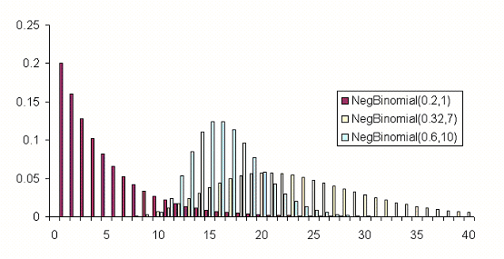
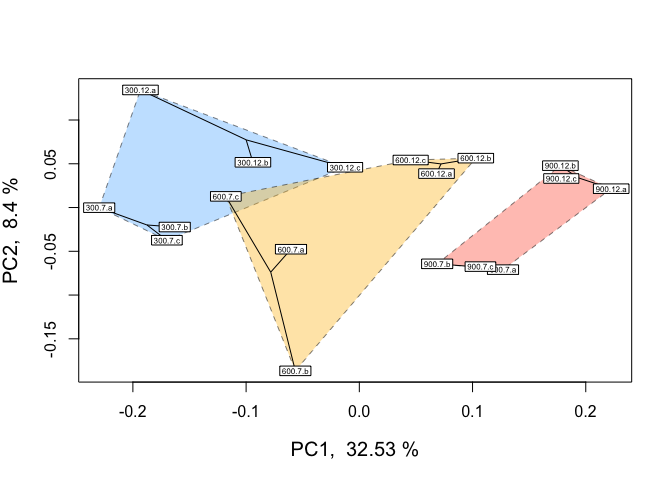

DGE\_comparison
================
Sam Bogan

# Notice to readers

This markdown remains a work in progress!

# Intro to multifactorial RNA-seq models

          Studies of molecular responses to environmental change increasingly employ multifactorial experimental designs incorporating multiple developmental stages, stressors, populations, or non-linear dynamics that resolve interactions which shape expression, physiology, and performance. However, it can be difficult to navigate what functionality popular differential expression (DE) packages have for fitting multivariate models or how to fit customized multifactorial models yourself when necessary. Additionally, most packages do not have the flexibility to accomodate a number of common experimental design components. Regardless of whether you have RNA-seq data on hand or you're in the process of planning your experiment, this walkthrough will help you navigate what DE packages and model fitting approaches are best suited to your experimental design.

## Variables we will cover

          This walkthrough can be broken down into different types of predictor variables that can be incoporated in models of gene expression. In the order we address them, these variables include:

-   Non-linear fixed effects
-   Continuous fixed effects
-   Interactive fixed effects
-   Random intercepts
-   Random slopes

## Packages we will cover

-   DESeq2 (Love, Huber, & Anders, 2014)
-   edgeR (Robinson, McCarthy, & Smyth, 2010)
-   Voom (often called Limma-Voom) (Law, Chen, Shi, & Smyth, 2014)

# Features of popular DGE packages

          Two important considerations when choosing a DE package to analyze RNA-seq data are the distribution family used by the package and the effect types it incorporate into a model. The DE packages we will cover assume the following read count distributions and are capable of fitting the following effect types:

<table style="width:42%;">
<colgroup>
<col width="6%" />
<col width="6%" />
<col width="6%" />
<col width="6%" />
<col width="6%" />
<col width="6%" />
</colgroup>
<thead>
<tr class="header">
<th align="left">Program</th>
<th align="left">Distribution</th>
<th align="left">Continuous fixed eff.</th>
<th align="left">Random intercepts</th>
<th align="left">Random slopes</th>
<th align="left">Interactive eff.</th>
</tr>
</thead>
<tbody>
<tr class="odd">
<td align="left">edgeR</td>
<td align="left">Negative binomial</td>
<td align="left">✔</td>
<td align="left">✖</td>
<td align="left">✖</td>
<td align="left">✔</td>
</tr>
<tr class="even">
<td align="left">DESeq2</td>
<td align="left">Negative binomial</td>
<td align="left">✔</td>
<td align="left">✖</td>
<td align="left">✖</td>
<td align="left">✔</td>
</tr>
<tr class="odd">
<td align="left">Voom</td>
<td align="left">Mean-variance estimate</td>
<td align="left">✔</td>
<td align="left">✔</td>
<td align="left">✖</td>
<td align="left">✔</td>
</tr>
</tbody>
</table>

## Summary of approach

          We will walk you through (i) how to conduct essential checks of your data such as principle components analysis and observing the distribution of filtered read counts, (ii) evaluating each package's functionality for multifactorial model fitting, and (iii) how to fit each type of predictor by performing differential expression tests using real data. These data come from an experiment that exposed the Anatarctic pteropod (a free-swimming planktonic snail) *Limacina helicina antarctica* to three continuous levels of ocean acidification (OA) for either 0.5 or 7 days. These RNA-seq counts are derived from reads mapped and counted via RSEM (Li & Dewey, 2011) using a *de novo* reference transcriptome that includes transcript isoforms assembled by Johnson & Hofmann (2016).

          Throughout this walkthrough, we will provide examples of in-house scripts for fitting linear, linear mixed models, generalized linear models to read count data using for loops in order to provide functionality where it cannt be met by most differential expression packages.

          At the end of the walkthrough, we demonstrate how to compare model predictions by different packages for different effect types commonly used in multifactorial RNAseq analyses.

          Let's start by loading our required packages...

``` r
## Unhash and run the code below if you believe you may need to install the packages loaded below

#invisible(lapply(c("DESeq2", "edgeR", "tidyverse", "ape", "vegan", "GGally",
                   #"arrayQualityMetrics", "rgl", "adegenet", "MASS",
                   #"data.table", "plyr", "lmtest", "reshape2", "Rmisc", "lmerTest"),
                 #function(p){
                   #if(! p %in% rownames(installed.packages())) {
                     #install.packages(p)
                  # }
                  # library(p, character.only=TRUE)
                 #}))

# Load packages
library(DESeq2)
library(edgeR)
library(tidyverse)
library(ape)
library(vegan)
library(GGally)
library(arrayQualityMetrics)
library(rgl)
library(adegenet)
library(MASS)
library(data.table)
library(plyr)
library(lmtest)
library(reshape2)
library(Rmisc)
library(lmerTest)
```

# Filter and visualize read counts

          Before model fitting and testing for DE, it is important to visually inspect read counts pre- and post-filtering. In this walk through, we will plot the distributions of read counts and sample loading to multidimensional scaling axes (e.g., plotting principal components or principal coordinates analyses). Looking at these plots, we can (i) determine whether the distribution of our data match the assumptions of model families used by different packages and (ii) determine whether one or multiple variables within a dataset explain a significant degree of variation in gene expression across replicates. Depending on the distribution of your data and the variables that appear important (or variable you would like to incorporate into your models), we will then demonstrate how to choose an appropriate package to test for DE.
          Most DE packages assume that read counts possess a negative binomial distribution. The negative binomial distribution is an extension of distributions for binary variables such as the Poisson distribution, allowing for estimations of "equidisperson" and "overdispersion", equal and greater-than-expected variation in expression attributed to biological variability . However, RNA-seq datasets can exhibit poor fits with the negative binomial distribution (Hawinkel, Rayner, Bijnens, & Thas, 2020). It is well worth visualizing and testing the distributions of RNA-seq read counts before and after filtering. Keep in mind that the distribution applies not to the raw data, but the residuals of a model. Additionally, individual models are fit to the read counts of each gene. Thus, the most accurate representation of how appropriate a negative binomial distribution is for read counts would come from plotting the distribution of residuals across all genes following model fitting. Below is a visual example of negative binomial distributions that possess different variances from modelassist\[dot\]epixanalytics\[dot\]com:



          Now let's first plot the distribution of unfiltered reads from our dataset:

``` r
# Read in matrix of RSEM expected read counts
data <- read.delim( "Input_data/GE2_expected_counts_gene.matrix", sep = "\t", header = T, row.names = 1 )

# Peak at data to check that it looks okay
head( data )
```

    ##                   B7a.genes.results B7b.genes.results B7c.genes.results
    ## TR100110|c0_g1_i1              4.00             10.00              3.00
    ## TR101578|c0_g1_i1              0.00              0.00              0.00
    ## TR1047|c0_g1_i1               14.00             19.00             11.00
    ## TR105096|c0_g1_i1             14.00             12.00              9.00
    ## TR107626|c1_g1_i1           4530.93          28139.91          14141.83
    ## TR11301|c0_g1_i1               0.00              0.00              0.00
    ##                   B12a.genes.results B12b.genes.results B12c.genes.results
    ## TR100110|c0_g1_i1               6.00                9.0               8.00
    ## TR101578|c0_g1_i1               0.00                0.0               0.00
    ## TR1047|c0_g1_i1                15.00               14.0               9.00
    ## TR105096|c0_g1_i1              15.00                5.0              10.00
    ## TR107626|c1_g1_i1           80846.09             5649.4           30756.08
    ## TR11301|c0_g1_i1                0.00                0.0               0.00
    ##                   R7a.genes.results R7b.genes.results R7c.genes.results
    ## TR100110|c0_g1_i1              18.0             15.00              6.00
    ## TR101578|c0_g1_i1               0.0              0.00              0.00
    ## TR1047|c0_g1_i1                16.0             16.00             27.00
    ## TR105096|c0_g1_i1              25.0             15.00              6.00
    ## TR107626|c1_g1_i1          137592.5          45299.57          14843.47
    ## TR11301|c0_g1_i1                0.0              0.00              0.00
    ##                   R12a.genes.results R12b.genes.results R12c.genes.results
    ## TR100110|c0_g1_i1              11.00               13.0                  9
    ## TR101578|c0_g1_i1               0.00                0.0                  0
    ## TR1047|c0_g1_i1                23.00               14.0                 11
    ## TR105096|c0_g1_i1              14.00               45.0                 12
    ## TR107626|c1_g1_i1           21210.52           230436.5                  0
    ## TR11301|c0_g1_i1                0.00                0.0                  0
    ##                   Y7a.genes.results Y7b.genes.results Y7c.genes.results
    ## TR100110|c0_g1_i1                 6                 4              12.0
    ## TR101578|c0_g1_i1                 0                 0               0.0
    ## TR1047|c0_g1_i1                  20                 3              18.0
    ## TR105096|c0_g1_i1                 9                 1              13.0
    ## TR107626|c1_g1_i1                 0                 0          112214.6
    ## TR11301|c0_g1_i1                  0                 0               0.0
    ##                   Y12a.genes.results Y12b.genes.results Y12c.genes.results
    ## TR100110|c0_g1_i1              21.00                 12              12.00
    ## TR101578|c0_g1_i1               0.00                  0               0.00
    ## TR1047|c0_g1_i1                25.00                 14               9.00
    ## TR105096|c0_g1_i1              14.00                 19              24.00
    ## TR107626|c1_g1_i1           86243.14             148100           74153.54
    ## TR11301|c0_g1_i1                0.00                  0               0.00

``` r
# Name experimental samples: names correspond to pCO2 treatment (300, 600, 900) + days (12 h2 vs 7 days) + replicate ID
colnames( data ) <- c( "300.7.a", "300.7.b", "300.7.c","300.12.a", "300.12.b", "300.12.c", 
                       "900.7.a", "900.7.b", "900.7.c", "900.12.a", "900.12.b", "900.12.c", 
                       "600.7.a", "600.7.b", "600.7.c", "600.12.a", "600.12.b", "600.12.c")

# Create 'targets' and 'Group dataframe, expressing experimental variables for DEG analysis 
pCO2 <- as.numeric( c( 255, 255, 255, 255, 255, 255,
                       530, 530, 530, 530, 530, 530,
                       918, 918, 918, 918, 918, 918 ) )

treatment <- c( "B", "B", "B", "B", "B", "B",
                "R", "R", "R", "R", "R", "R",
                "Y", "Y", "Y", "Y", "Y", "Y" )

day <- as.numeric( c( 7, 7, 7, .5, .5, .5,
                      7, 7, 7, .5, .5, .5,
                      7, 7, 7, .5, .5, .5 ) )

targets <- data.frame( pCO2, day, treatment )
targets$grouping <- paste( targets$pCO2, targets$day, sep = "." )

Group <- factor( paste( targets$day, targets$pCO2, sep = "_" ) )
cbind( targets, Group = Group )
```

    ##    pCO2 day treatment grouping   Group
    ## 1   255 7.0         B    255.7   7_255
    ## 2   255 7.0         B    255.7   7_255
    ## 3   255 7.0         B    255.7   7_255
    ## 4   255 0.5         B  255.0.5 0.5_255
    ## 5   255 0.5         B  255.0.5 0.5_255
    ## 6   255 0.5         B  255.0.5 0.5_255
    ## 7   530 7.0         R    530.7   7_530
    ## 8   530 7.0         R    530.7   7_530
    ## 9   530 7.0         R    530.7   7_530
    ## 10  530 0.5         R  530.0.5 0.5_530
    ## 11  530 0.5         R  530.0.5 0.5_530
    ## 12  530 0.5         R  530.0.5 0.5_530
    ## 13  918 7.0         Y    918.7   7_918
    ## 14  918 7.0         Y    918.7   7_918
    ## 15  918 7.0         Y    918.7   7_918
    ## 16  918 0.5         Y  918.0.5 0.5_918
    ## 17  918 0.5         Y  918.0.5 0.5_918
    ## 18  918 0.5         Y  918.0.5 0.5_918

``` r
# Data must be rounded to nearest integer in order to be fit for negative binomial distribution
data_input <- round( data )

# Peak at rounded data
head( data_input )
```

    ##                   300.7.a 300.7.b 300.7.c 300.12.a 300.12.b 300.12.c 900.7.a
    ## TR100110|c0_g1_i1       4      10       3        6        9        8      18
    ## TR101578|c0_g1_i1       0       0       0        0        0        0       0
    ## TR1047|c0_g1_i1        14      19      11       15       14        9      16
    ## TR105096|c0_g1_i1      14      12       9       15        5       10      25
    ## TR107626|c1_g1_i1    4531   28140   14142    80846     5649    30756  137592
    ## TR11301|c0_g1_i1        0       0       0        0        0        0       0
    ##                   900.7.b 900.7.c 900.12.a 900.12.b 900.12.c 600.7.a 600.7.b
    ## TR100110|c0_g1_i1      15       6       11       13        9       6       4
    ## TR101578|c0_g1_i1       0       0        0        0        0       0       0
    ## TR1047|c0_g1_i1        16      27       23       14       11      20       3
    ## TR105096|c0_g1_i1      15       6       14       45       12       9       1
    ## TR107626|c1_g1_i1   45300   14843    21211   230436        0       0       0
    ## TR11301|c0_g1_i1        0       0        0        0        0       0       0
    ##                   600.7.c 600.12.a 600.12.b 600.12.c
    ## TR100110|c0_g1_i1      12       21       12       12
    ## TR101578|c0_g1_i1       0        0        0        0
    ## TR1047|c0_g1_i1        18       25       14        9
    ## TR105096|c0_g1_i1      13       14       19       24
    ## TR107626|c1_g1_i1  112215    86243   148100    74154
    ## TR11301|c0_g1_i1        0        0        0        0

``` r
# Plot distribution of unfiltered read counts across all samples 
ggplot( data = data.frame( rowMeans( data_input ) ),
        aes( x = rowMeans.data_input. ) ) +
  geom_histogram( fill = "grey" ) +
  xlim( 0, 500 ) +
  theme_classic() +
  labs( title = "Distribution of unfiltered reads" ) +
  labs( y = "Density", x = "Raw read counts", title = "Read count distribution: untransformed, unnormalized, unfiltered" )
```



          Next, let's plot the distribution of filtered reads normalized by library size, expressed as log2 counts per million reads (logCPM):

``` r
# Make a DGEList object for edgeR
y <- DGEList( counts = data_input, remove.zeros = TRUE )

#Let's remove samples with less then 0.5 cpm (this is ~10 counts in the count file) in fewer then 9/12 samples
keep <- rowSums( cpm( y ) > .5 ) >= 9

table( keep )
```

    ## keep
    ## FALSE  TRUE 
    ## 18871 62579

``` r
# Set keep.lib.sizes = F and recalculate library sizes after filtering
y <- y[ keep, keep.lib.sizes = FALSE ]

y <- calcNormFactors( y )

# Calculate logCPM
df_log <- cpm( y, log = TRUE, prior.count = 2 )

# Plot distribution of filtered logCPM values
ggplot( data = data.frame( rowMeans( df_log ) ),
        aes( x = rowMeans.df_log. ) ) +
  geom_histogram( fill = "grey" ) +
  theme_classic() +
  labs( y = "Density", x = "Filtered read counts (logCPM)", 
        title = "Distribution of normalized, filtered read counts" )
```


          Our raw data appear to follow a strong negative binomial distribution! Later, we will see whether this holds for residuals from fitted negative binomial GLMs.

## MDS plot visualizing experimental factors

          Before analyzing our data, it is essential that we look at the multivariate relationships between our samples based on transcriptome-wide expression levels. Below is example code and output for a principle coordinates analysis (PCOA) plot that visualizes multifactorial RNA-seq replicates according to two predictor variables across major and minor latent variables or PCOA axes. These predictor variables, as discussed above, are *p*CO**<sub>2</sub> and time-in-treatment.

``` r
# Export pcoa loadings
dds.pcoa = pcoa( vegdist( t( df_log <- cpm( y, log = TRUE, prior.count = 2 ) ),
                          method = "euclidean") / 1000 )

# Create df of MDS vector loading
scores <- dds.pcoa$vectors

## Plot pcoa loadings of each sample, groouped by time point and pCO2 treatment

# Calculate % variation explained by each eigenvector
percent <- dds.pcoa$values$Eigenvalues
cumulative_percent_variance <- ( percent / sum( percent ) ) * 100

# Prepare information for pcoa plot, then plot
color <- c( "steelblue1", "tomato1", "goldenrod1")
par( mfrow = c( 1, 1 ) )
plot( scores[ , 1 ], scores[ , 2 ],
      cex=.5, cex.axis=1, cex.lab = 1.25,
      xlab = paste( "PC1, ", round( cumulative_percent_variance[ 1 ], 2 ), "%" ), 
      ylab = paste( "PC2, ", round( cumulative_percent_variance[ 2 ], 2 ), "%" ) )

# Add visual groupings to pcoa plot
ordihull( scores, as.factor(targets$treatment ), 
          border = NULL, lty = 2, lwd = .5, label = F,
          col = color, draw = "polygon", alpha = 100, cex = .5 )

ordispider( scores,as.factor( targets$grouping ),label = F ) # Vectors connecting samples in same pCO2 x time group

ordilabel( scores, cex = 0.5) # Label sample IDs
```


``` r
logCPM.pca <- prcomp( t ( df_log ) )
logCPM.pca.proportionvariances <- ( ( logCPM.pca$sdev ^ 2 ) / ( sum( logCPM.pca$sdev ^ 2 ) ) ) * 100


## Do treatment groups fully segregate? Wrap samples by pCO2 x time, not just pCO2
# Replot using logCPM.pca
plot( logCPM.pca$x, type = "n", main = NA, xlab = paste( "PC1, ", round( logCPM.pca.proportionvariances[ 1 ], 2 ), "%" ), ylab = paste( "PC2, ", round( logCPM.pca.proportionvariances[ 2 ], 2 ), "%" ) )

points( logCPM.pca$x, col = "black", pch = 16, cex = 1 )
colors2 <- c( "steelblue1", "dodgerblue2", "tomato1", "coral", "goldenrod1", "goldenrod3" )

ordihull( logCPM.pca$x, targets$grouping, 
          border = NULL, lty = 2, lwd = .5, 
          col = colors2, draw = "polygon", 
          alpha = 75,cex = .5, label = T )
```


          From this PCOA, we can see that treatment and time both influence multivariate gene expression across the RNA-seq samples. By and large, samples also cluster according to these two predictors in a manner consistent with what we would expect from our experimental design. After conducting QC analyses and plots of the read count data, it is time to begin model fitting and testing for differential expression.

# Non-linear effects

          Gene expression traits can exhibit non-linear performance curves across a continuous variable much like other physiological traits. Studies that incorporate more than two levels of a continuous predictor provide an opportunity to test for non-linear effects on gene expression. Similar to performance traits such as growth or metabolic rates, gene expression can be modelled across an continuous variable by fitting non-linear 'performance curves' to read count data. Rivera *et al.* 2021 recently discussed the benefits of fitting non-linear reaction norms to gene expression data in order to better model acclimation by tolerant and sensitive genotypes to an environmental stressor. In a conceptual figure of theirs, shown below, they depict non-linear variation in expression before, during, and after exposure to a stressor for four reaction norm phenotypes: (i) a tolerant conspecfic that frontloads (e.g., constitutively upregulates) stress-induced transcripts, (ii) a tolerant conspecific that exhibits reduced overall expression of stress-responsive transcripts, (iii) a sensitive conspecific that upregulates inducible transcripts and cannot recover post-stress, and (iv) a resilient conspecific that mounts a transcriptional stress response followed by recovery and downregulation (Rivera et al., 2021).

 From Rivera *et al.* 2021 - "Transcriptomic resilience and timing. (a) Gene expression reaction norms of four strategies during recovery after a stressor. We use triangles again for patterns that may confer tolerance and circles for patterns associated with stress sensitivity. While all triangle paths show a return to baseline (resilience) the pink (frontloading) and yellow (dampening) are also depicting differences in baseline and plasticity and are therefore labelled differently. (b) Adapted from the rolling ball analogy commonly used for ecological resilience and depicted in Hodgson et al. (2015). Each ball represents a gene showing a color-matched expression pattern in (a). Landscapes represent expression possibilities during a stress event. In the absence of stress, the ball will settle in a trough, representing baseline expression levels. Elasticity (rate of return to the baseline) is represented by the size of the arrow (i.e., larger arrows have faster rates of return). Pink dotted line is the expression landscape for the frontloaded ball. (c) Using Torres et al. (2016) loops through disease space as an alternative framework of an organism's path through stress response and recovery. The colour gradient represents the resulting phenotype for a given path through stress and recovery space, though x-and y-axis can denote any two parameters that are correlated but with a time lag."

          Non-linear reaction norms can be modelled across time, such as Rivera *et al.* have presented, or across multiple levels of an abiotic variable such as temperature, pH, etc in order to fit a performance curve. Performance curves are a fundamental tool in ecological physiology, and enable more robust hypothesis testing in RNA-seq studies of environmental acclimation. For example, testing for variation in the shape of gene expression performance curves between early and longterm exposure timepoints can provide critical information about the role of gene expression in acclimation. Below we outline how to fit and test for non-linear gene expression performance curves in multifactorial RNA-seq experiments using examples in edgeR, DESeq2, and in-house code.
          One of the simplest non-linear relationships that can be fitted to the expression of a transcript across an continuous variable is a second-order polynomial, otherwise known as a quadratic function, which can be expressed as *y*<sub>*i*</sub> = *μ* + *β*<sub>1</sub>*x*<sup>2</sup> + *β*<sub>2</sub>*x* where *y* is the abundance of a given transcript (*i*), *μ* is the intercept, and *y* is the continuous variable. For the parabola generated by fitting a second-order polynomial, *β*<sub>1</sub> &gt; 0 opens the parabola upwards while *β*<sub>1</sub> &lt; 0 opens the parabola downwards. The vertex of the parabola is controlled by *β*<sub>2</sub> such that when *β*<sub>1</sub> is negative, greater *β*<sub>2</sub> values result in the vertex falling at higher values of *x*.
          Quadratic polynomials applied to phenotypic performance curves commonly possess negative *β*<sub>1</sub> values with positive *β*<sub>2</sub> values: a downard-opening parabola with a positive vertex. However, quadtratic curves fitted to gene expression data can take on a variety of postiive or negative forms similar to exponential curves, saturating curves, and parabolas. For instance, the expression of a gene may peak an intermediate level of an environmental level before crashing or it may exponentially decline across that variable. Such trends may better model changes in the transcription of a gene compared to a linear model. To get started, we will fit non-linear second order polynomials before testing for whether model predictions for a given gene are significantly improved by a non-linear linear model.

## Non-linear effects: example in edgeR

          Let's fit a second-order polynomial for the effect of *p*CO**<sub>2</sub> using edgeR. Using differential expression tests, we will then determine whether *p*CO**<sub>2</sub> affected a gene's rate of change in expression and expression maximum by applying differential expression tests to *β*<sub>1</sub> and *β*<sub>2</sub> parameters. By testing for differential expression attributed to intereactions between time and *β*<sub>1</sub> or *β*<sub>2</sub>, we will then test for whether these parameters were significantly different across exposure times such that 0.5 days and 7 days of acclimation to *p*CO**<sub>2</sub> altered the rate of change in expression across *p*CO**<sub>2</sub> (*β*<sub>1</sub>) or the maximum of expression (*β*<sub>2</sub>).

``` r
# Square pCO2 variable
pCO2_2 <- pCO2^2

# Estimate dispersion coefficients
y1 <- estimateDisp( y, robust = TRUE ) # Estimate mean dispersal
```

    ## Design matrix not provided. Switch to the classic mode.

``` r
# Plot tagwise dispersal and impose w/ mean dispersal and trendline
plotBCV( y1 ) 
```


``` r
# Fit multifactorial design matrix
design_nl <- model.matrix( ~1 + pCO2_2 + pCO2 + pCO2_2:day + pCO2:day ) # Generate multivariate edgeR glm

# Fit quasi-likelihood, neg binom linear regression
nl_fit <- glmQLFit( y1, design_nl ) # Fit multivariate model to counts
plotQLDisp( nl_fit, col.shrunk = "red", col.raw = "black", col.trend = NULL )
```


``` r
## Test for effect of pCO2 and pCO2^2
nl_pCO2_2 <- glmQLFTest( nl_fit, coef = 2, contrast = NULL, poisson.bound = FALSE ) # Estimate significant DEGs
nl_pCO2 <- glmQLFTest( nl_fit, coef = 3, contrast = NULL, poisson.bound = FALSE ) # Estimate significant DEGs

# Make contrasts
is.de_nl_pCO2 <- decideTestsDGE( nl_pCO2, adjust.method = "fdr", p.value = 0.05 ) 
is.de_nl_pCO2_2 <- decideTestsDGE( nl_pCO2_2, adjust.method = "fdr", p.value = 0.05 )

# Summarize differential expression attributed to pCO2 and pCO2^2
summary( is.de_nl_pCO2 )
```

    ##         pCO2
    ## Down   14166
    ## NotSig 35037
    ## Up     13376

``` r
summary( is.de_nl_pCO2_2 )
```

    ##        pCO2_2
    ## Down    11091
    ## NotSig  39573
    ## Up      11915

          We have just fit our first GLM to our read count data and have tested for differential expression across *p*CO**<sub>2</sub>. At this stage, it is important to output a few diagnostic plots. For example, edgeR has the function 'plotMD()' which, when input with a differential expression test object such as a glmQLFTest, will produce a plot of differential expression log2 fold change values across gene expression level (log2 counts per million or logCPM). logCPM is a major component of gene function and statistical power, and is a useful variable to plot in order to make initial assessments of differential expression results.

``` r
# Plot differential expression due to pCO2 and pCO2^2
plotMD( nl_pCO2 )
```


``` r
plotMD( nl_pCO2_2 )
```


``` r
## Test for interactions between time and pCO2 or pCO2^2
nl_pCO2_int <- glmQLFTest( nl_fit, coef = 4, contrast = NULL, poisson.bound = FALSE ) # Estimate significant DEGs
nl_pCO2_2_int <- glmQLFTest( nl_fit, coef = 5, contrast = NULL, poisson.bound = FALSE ) # Estimate significant DEGs

# Make contrasts
is.de_nl_pCO2_int <- decideTestsDGE( nl_pCO2_int, adjust.method = "fdr", p.value = 0.05 ) # Make contrasts
is.de_nl_pCO2_2_int <- decideTestsDGE( nl_pCO2_2_int, adjust.method = "fdr", p.value = 0.05 )

# Summarize differential expression attributed to pCO2 and pCO2^2
summary( is.de_nl_pCO2_int )
```

    ##        pCO2_2:day
    ## Down            2
    ## NotSig      62573
    ## Up              4

``` r
summary( is.de_nl_pCO2_2_int )
```

    ##        pCO2:day
    ## Down        390
    ## NotSig    61918
    ## Up          271

``` r
# Plot differential expression due to pCO2 and pCO2^2
plotMD( nl_pCO2_int )
```


``` r
plotMD( nl_pCO2_2_int )
```


          Additionally, we can now output the residuals of our GLMs in order to better test for whether our data fit the assumptions of negative binomial distribution families. If the distribution of residuals from our GLMs are normal, this indicates that our data meet the assumption of the negative binomial distribution. We will use the equation for estimating Pearson residuals:
$$ residual = \\frac{observed - fitted} {\\sqrt{fitted(dispersion\*fitted)}} $$

``` r
# Output observed
y_nl <- nl_fit$counts

# Output fitted
mu_nl <- nl_fit$fitted.values

# Output dispersion or coefficient of variation
phi_nl <- nl_fit$dispersion

# Calculate denominator
v_nl <- mu_nl*(1+phi_nl*mu_nl)

# Calculate Pearson residual
resid.pearson <- (y_nl-mu_nl) / sqrt(v_nl)

# Plot distribution of Pearson residuals
ggplot(data = melt(as.data.frame(resid.pearson)), aes(x = value)) +
  geom_histogram( fill = "grey" ) +
  xlim(-2.5,5.0) +
  theme_classic() +
  labs(title = "Distribution of negative binomial GLM residuals", 
       x = "Pearson residuals", 
       y = "Density")
```


          Our residuals appear to be normally distributed, indicating that our data fit the negative binomial distribution assumed by the GLM.

## Plotting non-linear effects

          A variety of non-linear patterns may underly the significant effects we've observed above. For example, interactions between the vertex of expression and time may be attributed to variation in expression peaks across convex curves or the rate of decline in an exponentially decreasing curve among other patterns. Below we will assign transcripts exhibiting significant non-linear variation across *p*CO**<sub>2</sub> to different groups based on the values of parameters such as *β*<sub>1</sub> and *β*<sub>2</sub>. Then we will plot the expression of these grouped transcripts across *p*CO**<sub>2</sub> and time to visualize different sources of non-linear variation.

``` r
## Bin transcripts based on (i) whether they have a significant positive or negative vertex and then (ii) whether they showed significant interactions between beta1 (vertex value) and time.

# Export diff expression data for transcripts with significant DE associated with PCO2^2 parameter
nl_pCO2_2_sig <- topTags(nl_pCO2_2, n = (11091 + 11915), adjust.method = "BH", p.value = 0.05)
nl_pCO2_2_sig_geneids <- row.names(nl_pCO2_2_sig) #Output a list of geneids associated with sig PCO2^2 effect

nl_pCO2_sig <- topTags(nl_pCO2, n = (14166 + 13376), adjust.method = "BH", p.value = 0.05)
nl_pCO2_sig_geneids <- row.names(nl_pCO2_sig) #Output a list of geneids associated with sig PCO2 effect

# Create tabulated dataframe of mean expression across each pCO2 level with metadata for transcript ID and timepoint
logCPM_df <- as.data.frame(df_log)

# Create tabularized df containing all replicates using 'melt' function in reshape2
logCPM_df$geneid <- row.names(logCPM_df)
tab_exp_df <- melt(logCPM_df,
                   id = c("geneid"))

# Add covariate information for time and pCO2
tab_exp_df$pCO2 <- substr(tab_exp_df$variable, 1, 3)
tab_exp_df$time <- as.numeric(substr(tab_exp_df$variable, 5, 5))

# Correct pCO2s to exact values
tab_exp_df$pCO2 <- as.numeric(
  ifelse(tab_exp_df$pCO2 == "300", 255,
         ifelse(tab_exp_df$pCO2 == "900", 930, 
                518)))

# Correct time to exact values
tab_exp_df$time <- as.numeric(
  ifelse(tab_exp_df$time == "1", 0.5, 7))

# Create binary variable in df_all_log for significant non-linear expression
tab_exp_df$pCO2_2_sig <- ifelse(tab_exp_df$geneid %in% nl_pCO2_2_sig_geneids, "Yes", "No")
tab_exp_df$pCO2_sig <- ifelse(tab_exp_df$geneid %in% nl_pCO2_sig_geneids, "Yes", "No")

# Create a binary variable related to up or down-regulation
up_genes <- filter(nl_pCO2_sig$table, logFC > 0)
tab_exp_df$logFC_dir <- ifelse(tab_exp_df$geneid %in% row.names(up_genes), "Up", "Down")

# Add geneid to nl_pCO2_int$coefficients
nl_pCO2_int$coefficients$geneid <- row.names(nl_pCO2_int$coefficients)

# Estimate average logCPM per gene per timepoint
tab_exp_avg <- summarySE(measurevar = "value",
                         groupvars = c("pCO2", "time", "geneid", "pCO2_sig", "pCO2_2_sig", "logFC_dir"),
                         data = tab_exp_df)

# First exploratory plot of non-linear expression grouping by exposure time and direction of differential expression
ggplot(data = filter(tab_exp_avg, pCO2_2_sig == "Yes"), 
       aes(x = pCO2, y = value)) +
  geom_path(alpha = 0.01, size = 0.25, stat = "identity", aes(group = as.factor(geneid))) +
    facet_grid(logFC_dir~time) +
  theme_classic() +
  theme(strip.background = element_blank()) +
  labs(y = "Avg logCPM", title = "Non-linear changes in GE output by edgeR")
```


          Our plot of gene expression across tens of thousands of transcripts exhibiting significant non-linear changes across *p*CO**<sub>2</sub> appears to include many trends that appear... well, linear. This is a pervasive issue in modeling non-linear regressions, and one potential pitfall of using outputs from packages such as edgeR or DESeq2 alone in testing for non-linear effects. The FDR-adjusted *p*-values we have used determine significance of non-linear effects essentially tell us the probability that a parameter value equal to or greater to what we have fitted could be generated given a random distribution of read counts. The *p*-value is not a representation of the strength of a non-linear effect relative to a linear effect. Numerous genes that nominally show significant non-linear effects of *p*CO**<sub>2</sub> may be only weakly affected, and a linear effect may in fact be more probable than a non-linear one despite what our p-values tell us. Instead of asking "for what genes may there be significant, non-linear effects of *p*CO**<sub>2</sub>?", we should ask "for what genes *should* we test for significant, non-linear effects?".
          One of the best ways to determine whether a non-linear model is appropriate for a transcript is to determine whether it is more probable that its expression is linear or non-linear relative to a continuous predictor. We can calculate this relative probability using a likelihood ratio test (LRT). In the code chunk below, we will fit linear and 2nd order non-linear models to the expression of each gene before applying LRTs to each transcript. We will then further filter our edgeR dataset based on (i) significant differential expression attributed to non-linear effects and (ii) a significant LRT ratio supporting non-linear effects. Then, we will replot the expression levels of this re-filtered set. The code below fits gaussian linear models to log2-transformed CPM values, but can be adjusted to fit negative binomial GLMs to untransformed CPM similar to edgeR and DESeq2 by setting using the MASS package to set 'family = negative\_binomial(theta = *θ*)' where *θ* = the dispersion estimate or biological coefficient of variation for a given transcript.

``` r
## Using dlply, fit linear and non-linear models to each gene
# Create pCO2^2 variable in df_all_log
tab_exp_df$pCO2_2 <- tab_exp_df$pCO2^2

# Filter tabularized logCPM df for read depth of logCPM >= 0.5 in > 75% of samples


# Fit linear models - should take about 4 minutes
lms <- dlply(tab_exp_df, c("geneid"), function(df) 
lm(value ~ pCO2 + time + pCO2:time, data = df))

# Fit non-linear models - should take about 2 minutes
nlms <- dlply(tab_exp_df, c("geneid"), function(df) 
lm(value ~ pCO2 + pCO2_2 + time + pCO2:time + pCO2_2:time, data = df))

# Output nlm coefficients into dataframe
nlms_coeff <- ldply(nlms, coef)
head(nlms_coeff)
```

    ##              geneid (Intercept)          pCO2        pCO2_2        time
    ## 1 TR107626|c1_g1_i1   1.9361224  3.995760e-02 -3.819357e-05  3.39371568
    ## 2 TR141909|c0_g1_i1   2.5171022 -2.413737e-03  1.468135e-06 -0.18785174
    ## 3 TR141946|c0_g1_i1  -1.0829071  2.491456e-03 -3.180644e-06 -0.27604730
    ## 4 TR141946|c0_g1_i2   0.6669886  5.415472e-03 -3.724832e-06  0.11726202
    ## 5 TR141951|c0_g1_i1   2.0588461 -7.240810e-04  1.457408e-06  0.01615581
    ## 6 TR141972|c0_g1_i1   0.3458156 -5.983124e-05 -5.072419e-06  0.16036294
    ##       pCO2:time   pCO2_2:time
    ## 1 -0.0180847725  1.627584e-05
    ## 2  0.0007717623 -5.931927e-07
    ## 3  0.0008763072 -5.730126e-07
    ## 4 -0.0006632481  5.727356e-07
    ## 5  0.0000993039 -1.247330e-07
    ## 6 -0.0001885367  3.957829e-07

``` r
## Apply LRTs to lm's and nlm's for each transcript - should take about 2 minutes
lrts <- list() # Create list to add LRT results to

for (i in 1:length(lms)) {
 lrts[[i]] <- lrtest(lms[[i]], nlms[[i]]) # Apply LRTs with for loop
}

## Filter lrt results for transcripts with significantly higher likelihoods of nl model
lrt_dfs <- list()

# Turn list of LRT outputs into list of dataframes containing output info
for (i in 1:length(lrts)) {
 lrt_dfs[[i]] <- data.frame(lrts[i])
}

# Create singular dataframe with geneids and model outputs for chi-squared and LRT p-value
lrt_coeff_df  <- na.omit(bind_rows(lrt_dfs, .id = "column_label")) # na.omit removes first row of each df, which lacks these data

# Add geneid based on element number from original list of LRT outputs
lrt_coeff_df <- merge(lrt_coeff_df,
                      data.frame(geneid = names(nlms),
                                 column_label = as.character(seq(length(nlms)))),
                      by = "column_label")

# Apply FDR adjustment to LRT p-values before filtering for sig non-linear effects
lrt_coeff_df$FDR <- p.adjust(lrt_coeff_df$Pr..Chisq., method = "fdr")

# Filter LRT results for sig FDR coeff... produces 162 genes
lrt_filt <- filter(lrt_coeff_df, FDR < 0.05)

## Plot sig nl genes according to LRT, grouped by timepoint and direction of beta 1 coefficient
# Add beta coefficients to logCPM df
pCO2_pos <- filter(nlms_coeff, pCO2 > 0)
pCO2_2_pos <- filter(nlms_coeff, pCO2_2 > 0)

# Bin genes based on positive or negative pCO2 and pCO2^2 betas
tab_exp_avg$pCO2_binom <- ifelse(tab_exp_avg$geneid %in% pCO2_pos$geneid, "Positive", "Negative")
tab_exp_avg$pCO2_2_binom <- ifelse(tab_exp_avg$geneid %in% pCO2_2_pos$geneid, "Concave", "Convex")

# Filter for how many gene id's with significant likelihood of nl effect in LRT
LRT_filt_df <- filter(tab_exp_avg, geneid %in% lrt_filt$geneid)

# Plot
ggplot(data = LRT_filt_df, 
       aes(x = pCO2, y = value)) +
  geom_path(alpha = .25, size = 0.25, stat = "identity", aes(group = as.factor(geneid))) +
    facet_grid(pCO2_2_binom~time) +
  geom_smooth(method = "loess", se = TRUE, span = 1) +
  theme_classic() +
  theme(strip.background = element_blank()) +
  labs(y = "Avg logCPM", title = "Non-linear changes in GE output by LRTs")
```


``` r
# Count how many gene id's with significant likelihood of nl effect in LRT... 162 genes
nrow(as.data.frame(unique(LRT_filt_df$geneid)))
```

    ## [1] 162

          The above plot, which visualizes the expression of 162 genes identified in LRTs to exhibit significant and high likelihoods of non-linear variation in logCPM across *p*CO**<sub>2</sub>, appears distinct from our first plot of non-linear expression deemed significant by edgeR. The overall trends appear to be more convex or concave, consistent with a second-order polynomial regressions. This speaks to the strength of LRTs in identifying probable, non-linear effects or other multifactorial effects.
          Let's see how many non-linear transcripts identified in LRTs exhibited significant non-linear effects within our edgeR models. To do this, we'll filter down the significant DEGs output by edgeR to include gene id's within our significant LRT output. Then, we'll plot the expression of this filtered set across *p*CO**<sub>2</sub>.

``` r
# Filter down df for gene id's exhibit pCO2 significant effect in edgeR and significant likelihood of nl effect in LRT 
edgeR_LRT_df <- filter(tab_exp_avg, geneid %in% lrt_filt$geneid & pCO2_sig == "Yes" |
                         geneid %in% lrt_filt$geneid & pCO2_2_sig == "Yes")

# Plot 
ggplot(data = edgeR_LRT_df, 
       aes(x = pCO2, y = value)) +
  geom_path(alpha = .25, size = 0.25, stat = "identity", aes(group = as.factor(geneid))) +
  facet_grid(pCO2_2_binom~time) +
  geom_smooth(method = "loess", se = TRUE, span = 1) +
  theme_classic() +
  theme(strip.background = element_blank()) +
  labs(y = "Avg logCPM", title = "Non-linear changes in GE output by edgeR & LRTs")
```


``` r
# Count how many gene id's exhibit pCO2 significant effect in edgeR and significant likelihood of nl effect in LRT... 89 genes
nrow(as.data.frame(unique(edgeR_LRT_df$geneid)))
```

    ## [1] 89

        89 genes exhibited a significant effect of *p*CO**<sub>2</sub> or *p*CO**<sub>2</sub>^2 and a high likelihood of a non-linear as identified by an LRT. This number is substantially lower than the tens of thousands of genes identified by edgeR alone and the 162 identified via LRT. Additionally, there only appears to be partial overlap between edgeR and LRTs, speaking to the difference in the information you can extract from a significant effect identified in a generalized linear model (e.g., edgeR) vs. likelihood-based appraoches such as an LRT. Because these two tests provide distinct and valuable information, the most robust estimate of we have laid out for non-linear effects of *p*CO**<sub>2</sub> on gene expression comes from filtering for significant DEGs in edgeR *and* significant LRTs.
        What combination of approaches are most informative ultimately depends on your experimental design and the question you are addressing. For example, we can explore an additional question that our previous graphs did not touch on: how does gene expression vary between exposure times for genes exhibiting significant interactions between *p*CO**<sub>2</sub>^2 and time? Let's produce an exploratory plot of non-linear expression across 0.5 and 7 days of exposure for such genes identified using edgeR alone.

``` r
# Export diff expression data for transcripts with significant DE associated with interaction between PCO2^2 and time
nl_pCO2_2_int_sig <- topTags(nl_pCO2_2_int, n = (390 + 271), adjust.method = "BH",p.value = 0.05)
nl_pCO2_2_int_sig_geneids <- row.names(nl_pCO2_2_int_sig) #Output a list of geneids associated with sig PCO2^2 x time interaction

# Filter down df for gene id's exhibit pCO2 significant effect in edgeR and significant likelihood of nl effect in LRT 
edgeR_interaction_df <- filter(tab_exp_avg, geneid %in% nl_pCO2_2_int_sig_geneids )
edgeR_interaction_df$gene_id_time <- paste(edgeR_interaction_df$geneid,
                                           edgeR_interaction_df$time,
                                           sep = "_")

# Average logCPM across different groups according to pCO2^2 estimate and time
edgeR_interaction_avg <- summarySE(measurevar = "value",
                                   groupvars = c("time", "pCO2", "pCO2_2_binom"),
                                                 data = edgeR_interaction_df)

# Plot 
ggplot(data = edgeR_interaction_avg, 
       aes(x = pCO2, y = value, color = as.factor(time), group = as.factor(time))) +
  geom_path(stat = "identity") +
  geom_errorbar(aes(ymin = value - se, ymax = value + se), width = 0) +
  geom_point() +
  facet_wrap(~pCO2_2_binom) +
  theme_classic() +
  theme(strip.background = element_blank()) +
  labs(y = "logCPM", color = "Time (days)", title = "Interactions between pCO2^2 and exposure time")
```


        After visualizing variation in expression across *p*CO**<sub>2</sub> for genes identified in edgeR to be affected by interactions between *p*CO**<sub>2</sub>^2 and exposure time, we can see interesting changes in gene expression curves across time. For example, genes that exhibited a convex expression curve at 0.5 days of exposure generally modified their curve such that their expression became postiviely exponential relative to *p*CO**<sub>2</sub>. One potenetial explanation for this change is that the upregulation of some genes under intermediate *p*CO**<sub>2</sub> was reudced following acclimation, while less acclimation may have occurred at the higher *p*CO**<sub>2</sub> level after 7 days. Genes with a concave expression curves across *p*CO**<sub>2</sub> at 0.5 days of exposure exhibited a marked decrease in expression as the experiment progressed, regardless of *p*CO**<sub>2</sub> level. Thus, the interaction between *p*CO**<sub>2</sub>^2 and time may affect 'convex' and 'concave' genes in entirely different ways, underscorign the importance of partitioning or binning your data by parameters such as *p*CO**<sub>2</sub>^2. Exploring your data in this way is important for understanding interactive effects in RNA-seq analyses, regardless of whether or not you are fittting non-linear or linear continuous effects. Below we discuss further considerations for modeling interactions between linear continuous predictors.

# Interactive effects

        Interactive effects shaping gene expression are common in nature and are becoming increasingly prevalent in models of gene expression derived from experimental studies. Below, we outline methods for fitting intereactive effects using categorical and continuous variables in models of expression. We provide examples in edgeR, DESeq2, and Voom before comparing correlations between these programs' fold change (logFC) predictions and test statistics.

## Interactive effects: edgeR

``` r
# Fit multifactoria design matrix
design_multi <- model.matrix( ~1 + pCO2 + pCO2:day ) #Generate multivariate edgeR glm

# Ensure that design matrix looks correct
colnames( design_multi )
```

    ## [1] "(Intercept)" "pCO2"        "pCO2:day"

``` r
# Fit quasi-likelihood, neg binom linear regression
multi_fit <- glmQLFit( y1, design_multi ) # Fit multivariate model to counts
plotQLDisp( multi_fit, col.shrunk = "red", col.raw = "black", col.trend = NULL )
```


``` r
# Test for effect of pCO2
tr_pCO2 <- glmQLFTest( multi_fit, coef = 2, contrast = NULL, poisson.bound = FALSE ) # Estimate significant DEGs

is.de_tr_pCO2 <- decideTestsDGE( tr_pCO2, adjust.method = "fdr", p.value = 0.05 ) # Make contrasts

summary( is.de_tr_pCO2 )
```

    ##         pCO2
    ## Down       0
    ## NotSig 62579
    ## Up         0

``` r
plotMD( tr_pCO2 )

# Interaction
tr_int <- glmQLFTest( multi_fit, coef = 2, poisson.bound = FALSE ) # Estimate significant DEGs

is.de_int <- decideTestsDGE( tr_int, adjust.method = "fdr", p.value = 0.05 ) # Make contrasts

summary( is.de_int )
```

    ##         pCO2
    ## Down       0
    ## NotSig 62579
    ## Up         0

``` r
plotMD( tr_int )
```


``` r
# Check residuals
edgeR_res <- residuals( multi_fit, type = "pearson" )
head( edgeR_res )
```

    ## NULL

## Interactive effects: limma-voom

``` r
# Perform voom transformation
voom <- voom( y, design_multi, plot = T )
```


``` r
# Fit using voom
lm_voom_fit <- lmFit( voom, design_multi )

# Create a contrast across continuous pCO2 variable
cont_pCO2 <- contrasts.fit( lm_voom_fit, coef = "pCO2" )

# Create a contrast across interaction etween continuous pCO2 and time variables
cont_pCO2_day <- contrasts.fit( lm_voom_fit, coef = "pCO2:day" )

# Perform empirical Bayes smoothing of standard errors
lm_voom_fit <- eBayes( lm_voom_fit )

# Output test statistics
pCO2_results <- topTable( lm_voom_fit, coef = "pCO2", adjust.method="fdr", n = Inf )
pCO2_day_results <- topTable( lm_voom_fit, coef = "pCO2:day", adjust.method="fdr", n = Inf )

# How many DEG are associated with pCO2 and pCO2:day?
length( which( pCO2_results$adj.P.Val < 0.05 & abs( pCO2_results$logFC ) > ( 4 / 600 ) ) ) # number of DE genes = 7091
```

    ## [1] 0

``` r
length( which( pCO2_results$adj.P.Val < 0.05  ) ) # number of DE genes
```

    ## [1] 0

``` r
length( which( pCO2_day_results$adj.P.Val < 0.05 & 
                 abs( pCO2_day_results$logFC ) > ( 4 / 600 ) ) ) # number of DE genes = 7091
```

    ## [1] 0

``` r
length( which( pCO2_day_results$adj.P.Val < 0.05  ) ) # number of DE genes
```

    ## [1] 1628

## Interactive effects: DESeq2

As such, the DESeq2 code below only fits the interaction term to the read count data.

    ## Removing 1761 rows with all zero counts

    ## keep_g
    ## FALSE  TRUE 
    ## 20632 62579

    ##    pCO2 day treatment grouping
    ## 1   255 7.0         B    255.7
    ## 2   255 7.0         B    255.7
    ## 3   255 7.0         B    255.7
    ## 4   255 0.5         B  255.0.5
    ## 5   255 0.5         B  255.0.5
    ## 6   255 0.5         B  255.0.5
    ## 7   530 7.0         R    530.7
    ## 8   530 7.0         R    530.7
    ## 9   530 7.0         R    530.7
    ## 10  530 0.5         R  530.0.5
    ## 11  530 0.5         R  530.0.5
    ## 12  530 0.5         R  530.0.5
    ## 13  918 7.0         Y    918.7
    ## 14  918 7.0         Y    918.7
    ## 15  918 7.0         Y    918.7
    ## 16  918 0.5         Y  918.0.5
    ## 17  918 0.5         Y  918.0.5
    ## 18  918 0.5         Y  918.0.5

    ## converting counts to integer mode

    ##   the design formula contains one or more numeric variables with integer values,
    ##   specifying a model with increasing fold change for higher values.
    ##   did you mean for this to be a factor? if so, first convert
    ##   this variable to a factor using the factor() function

    ##   the design formula contains one or more numeric variables that have mean or
    ##   standard deviation larger than 5 (an arbitrary threshold to trigger this message).
    ##   it is generally a good idea to center and scale numeric variables in the design
    ##   to improve GLM convergence.

    ## estimating size factors

    ## estimating dispersions

    ## gene-wise dispersion estimates

    ## mean-dispersion relationship

    ## final dispersion estimates

    ## fitting model and testing

# Random Intercepts: example in voom

We will skip edgeR and DESeq2 since they cannot fit random effects.

        Random intercepts (often referred to as random effects) can be an essential component of estimating differential expression in experiments that incorporate non-independent observations (e.g., repeated measures and nested designs: individuals within populations or families) or randomly sampled groups. Most differential expression packages do not possess functionality for fitting random intercepts, extending GLMs to generalized linear mixed models or GLMMs, but voom does! Additional packages that we don't cover here also possess random intercept functionality, including dream (Hoffman & Roussos, 2021) and [glmmSeq](https://cran.r-project.org/web/packages/glmmSeq/index.html).
        Below is an example of how to fit a random intercept associated with the time variable of our dataset:

``` r
# Fit multifactoria design matrix
design_rand <- model.matrix( ~1 + pCO2 + ( 1 | day ) ) #Generate multivariate edgeR glm

# Perform voom transformation
voom_rand <- voom( y, design_rand, plot = T )
```

    ## Coefficients not estimable: 1 | dayTRUE


``` r
# Fit using voom
lm_voom_fit_rand <- lmFit( voom_rand, design_rand )
```

    ## Coefficients not estimable: 1 | dayTRUE

``` r
# Create a contrast across continuous pCO2 variable
cont_rand_day <- contrasts.fit( lm_voom_fit_rand, coef = "pCO2" )

# Perform empirical Bayes smoothing of standard errors
lm_voom_fit_rand <- eBayes( lm_voom_fit_rand )

# Output test statistics
rand_results <- topTable( lm_voom_fit_rand, coef = "pCO2", adjust.method = "fdr", n = Inf )

# How many DEG are associated with pCO2 and pCO2:day?
length( which( rand_results$adj.P.Val < 0.05 & abs( rand_results$logFC ) > ( 4 / 600 ) ) ) # number of DE genes = 7091
```

    ## [1] 3

``` r
length( which( rand_results$adj.P.Val < 0.05  ) ) # number of DE genes
```

    ## [1] 3

``` r
length( which( rand_results$adj.P.Val < 0.05 & 
                 abs( rand_results$logFC ) > ( 4 / 600 ) ) ) # number of DE genes = 7091
```

    ## [1] 3

``` r
length( which( rand_results$adj.P.Val < 0.05  ) ) # number of DE genes
```

    ## [1] 3

# Random slopes

        Distinct from the random intercept, testing for variation in gene expression attributed to a random slope effect asks "Within a set of groups, does the reaction norm of gene expression across a continuous predictor randomly by group?". This question is relavent to experimental designs testing for differences in the plasticity of gene expression across randomly-selected demographics such as genotypes or families. For these kinds of groups, modelling an interaction between the continuous predictor and a categorical effecat representing different groups would be inappropriate, as the use of a categorical effect should be reserved for groups-of-interest specific selected in an experiment (e.g., different sexes, populations inhabiting distinct environments, etc.). To our knowledge however, there is no well-documented differential expression package that enables the fitting of random slopes. Below we detail a custom script for fitting gaussian linear mixed models using lme4 and negative binomial GLMs to read count data. For practical purposes, we will treat exposure time as a random variable even though timepoints were not randomly selected in the experiment that produced our data and apply. We will also apply linear mixed models using lmer, which is computationally intensive. The models fitted below are input with a highly filtered and reduced set of read count data.

``` r
## For practical purposes, reduce size of input data in order to run lmer in for loop without using up memory
# Re-filter data
keep_red <- rowSums( cpm( y ) > 3 & cpm( y ) < 10 ) >= 12

# Apply read filter to tab_exp_df
tab_exp_df_filt <- filter(tab_exp_df, geneid %in% 
                            row.names(filter(as.data.frame(keep_red), keep_red == TRUE)))

# Using dlply, fit linear mixed model to tabularized df of log2-transformed CPM values for each transcript... should take 15 minutes w/ 7 cores
tab_exp_df_filt$time <- as.factor(tab_exp_df_filt$time)
rs_lmes <- dlply(tab_exp_df_filt, c("geneid"), function(df) 
lmer(value ~ pCO2 + (pCO2 | time), data = df))

# Output rs_lme coefficients into dataframe
## Filter lrt results for transcripts with significantly higher likelihoods of nl model
rs_lme_dfs <- list()

# Turn list of lmer outputs into list of dataframes containing output info
for (name in names(rs_lmes)) {
 rs_lme_dfs[[name]] <- coef(rs_lmes[[name]])$time
}

# Output F and p-values from anova's of lmer models
rs_lme_aovs <- list()

for (name in names(rs_lmes)) {
 rs_lme_aovs[[name]] <- as.data.frame(anova(rs_lmes[[name]]))
}

# Create singular dataframe containing geneid's, time points, and their random pCO2 slopes
rs_lme_coef_df  <- na.omit(bind_rows(rs_lme_dfs, .id = "column_label"))
rs_lme_coef_df$time <- ifelse(grepl("0.5", row.names(rs_lme_coef_df)), "0.5", "7")

# Create binary variable for sign of pCO2 slope
rs_lme_coef_df$Sign <- ifelse(rs_lme_coef_df$pCO2 > 0, "Positive", "Negative")

# Create singular dataframe containing geneid's, F-values, and p values from anova's of lmer models
rs_lme_aov_df  <- na.omit(bind_rows(rs_lme_aovs, .id = "column_label"))

# Adjust aov p-values using FDR and filter results for significant effects of pCO2
rs_lme_aov_df$FDR <- p.adjust(rs_lme_aov_df$`Pr(>F)`, method = "fdr")
sig_lme_list <- filter(rs_lme_aov_df, FDR < 0.05)

# Plot random slopes grouped by timepoint
ggplot(data = filter(rs_lme_coef_df, column_label %in% sig_lme_list$column_label),
       aes(x = as.numeric(time), y = pCO2, group = column_label)) +
  geom_path(alpha = 0.1, size = .5) +
  theme_classic() +
  labs(y = "pCO2 effect (logCPM/uatm)", x = "Exposure time (days)", 
       title = "Random slopes of DE genes across time")
```


# Comparing test statistics

        Differential expression packages can make dramatically different predictions for both the fold-change and probability of differential expression. If you find yourself deciding between different packages or wanting to compare how conservative different approaches are, it helps to run regressions of model predictions by different packages. Below we apply the ggpairs() function from GGAlly to plot a correlation matrix of logFC values and negative log-transformed p-values from edgeR, DESeq2, and voom:

``` r
# Merge logFC and pval data from each program
voom_edgeR_deseq_int_comp <- merge( 
  merge(
    data.frame( geneid = row.names( pCO2_day_results ),
                voom_logFC = pCO2_day_results$logFC,
                voom_pval = pCO2_day_results$P.Value ),
    data.frame( geneid = row.names( tr_int$table ),
                edgeR_logFC = -( tr_int$table$logFC ), #negate logFC because of syntax differences
                edgeR_pval = tr_int$table$PValue ), 
    by = "geneid" ),
  data.frame( geneid = row.names( DESeq2_int_results ),
              DESeq2_logFC = DESeq2_int_results$log2FoldChange,
              DESeq2_pval = DESeq2_int_results$pvalue ),
  by = "geneid" )

# Create neg log pvalues
voom_edgeR_deseq_int_comp$voom_neglogp <- -log( voom_edgeR_deseq_int_comp$voom_pval )
voom_edgeR_deseq_int_comp$edgeR_neglogp <- -log( voom_edgeR_deseq_int_comp$edgeR_pval )
voom_edgeR_deseq_int_comp$DESeq2_neglogp <- -log( voom_edgeR_deseq_int_comp$DESeq2_pval )

# Correlation matrix of pvalues
pval_pairs <- ggpairs( data = voom_edgeR_deseq_int_comp,
                       columns = c( 8, 9, 10 ),
                       mapping = aes( alpha = 0.001 ) ) +
  labs( title = "Correlation matrix: interaction p-values" )

pval_pairs
```


``` r
# Create neg log pvalues
voom_edgeR_deseq_int_comp$voom_neglogp <- -log( voom_edgeR_deseq_int_comp$voom_pval )
voom_edgeR_deseq_int_comp$edgeR_neglogp <- -log( voom_edgeR_deseq_int_comp$edgeR_pval )
voom_edgeR_deseq_int_comp$DESeq2_neglogp <- -log( voom_edgeR_deseq_int_comp$DESeq2_pval )

# Correlation matrix of logFC's
logFC_pairs <- ggpairs( data = voom_edgeR_deseq_int_comp,
                       columns = c( 2, 4, 6 ),
                       mapping = aes( alpha = 0.001 ) ) +
  labs( title = "Correlation matrix: interaction logFC's" )

logFC_pairs
```


``` r
# Correlation of logFC
ggplot( data = voom_edgeR_deseq_int_comp,
        aes( x = voom_logFC, y = edgeR_logFC ) ) +
  geom_hex( bins = 100,
            aes(fill = stat( log( count ) ) ) ) +
  theme_classic() +
  scale_fill_viridis_c() +
  geom_smooth( method = "lm", color = "red", lty = 2 ) +
  labs( title = "Interactions: edgeR vs. limma-voom logFC's", 
        x = "limma-voom logFC",
        y = "edgeR logFC" )
```


``` r
# Correlations between pvals
ggplot( data = voom_edgeR_deseq_int_comp,
        aes( x = -log( voom_pval ), y = -log( edgeR_pval ) ) ) +
  geom_hex( bins = 100,
            aes(fill = stat( log( count ) ) ) ) +
  theme_classic() +
  scale_fill_viridis_c() +
  geom_smooth( method = "lm", color = "red", lty = 2 ) +
  labs( title = "Interactions: edgeR vs. limma-voom p-values", 
        x = "limma-voom pval",
        y = "edgeR pval" )
```


``` r
# Correlation of logFC: edgeR vs DESeq2 
ggplot( data = voom_edgeR_deseq_int_comp,
        aes( x = DESeq2_logFC, y = edgeR_logFC ) ) +
  geom_hex( bins = 100,
            aes(fill = stat( log( count ) ) ) ) +
  theme_classic() +
  scale_fill_viridis_c() +
  geom_smooth( method = "lm", color = "red", lty = 2 ) +
  labs( title = "Interactions: edgeR vs. DESeq2 logFC's", 
        x = "DESeq2 logFC",
        y = "edgeR logFC" )
```


``` r
# Correlation of logFC: edgeR vs DESeq2 
ggplot( data = voom_edgeR_deseq_int_comp,
        aes( x = -log( DESeq2_pval ), y = -log( edgeR_pval ) ) ) +
  geom_hex( bins = 100,
            aes(fill = stat( log( count ) ) ) ) +
  xlim( values = c( 0, 20 ) ) +
  theme_classic() +
  scale_fill_viridis_c() +
  geom_smooth( method = "lm", color = "red", lty = 2 ) +
  labs( title = "Interactions: edgeR vs. DESeq2 p-values", 
        x = "DESeq2 logFC",
        y = "edgeR logFC" )
```


        This linear mixed model can also be modified and fit to non-log transformed CPM counts as a generalized linear mixed model using a negative binomial distribution, similar to that employed by edgeR and DESeq2. The code chunk below uses our reduced data to produce an example of fitting customized glmm's. Negative binomial model family requires a value for *θ* (e.g., the CV or dispersion of expression per gene). In this case, we will use the function 'glmer.nb()' from lme4, which will automatically estimate *θ* for all models.

``` r
# Reverse log2 transormation by exponentiating
#tab_exp_df_filt$CPM <- 2^tab_exp_df_filt$value

# Scale predictor pCO2 variable to assist with glmer fitting
#tab_exp_df_filt$pCO2_Z <- scale(tab_exp_df_filt$pCO2)

# Merge dispersion estimates with tab_exp_df_filt
#tab_exp_df_filt <- merge(tab_exp_df_filt,
                         #data.frame(geneid = row.names(y1$counts),
                                    #Disp = y1$tagwise.dispersion),
                         #by = "geneid")

# Fit glmmer's with dispersion estimates
#rs_glmms <- dlply(tab_exp_df_filt, c("geneid"), function(df) 
#glmer.nb(CPM ~ pCO2_Z + (pCO2_Z | time) , data = df))
```

Hawinkel, S., Rayner, J. C. W., Bijnens, L., & Thas, O. (2020). Sequence count data are poorly fit by the negative binomial distribution. *PLoS One*, *15*(4), e0224909.

Hoffman, G. E., & Roussos, P. (2021). Dream: Powerful differential expression analysis for repeated measures designs. *Bioinformatics*, *37*(2), 192–201.

Johnson, K. M., & Hofmann, G. E. (2016). A transcriptome resource for the antarctic pteropod limacina helicina antarctica. *Mar. Genomics*, *28*, 25–28.

Law, C. W., Chen, Y., Shi, W., & Smyth, G. K. (2014). Voom: Precision weights unlock linear model analysis tools for RNA-seq read counts. *Genome Biol.*, *15*(2), R29.

Li, B., & Dewey, C. N. (2011). RSEM: Accurate transcript quantification from RNA-Seq data with or without a reference genome. *BMC Bioinformatics*, *12*, 323.

Love, M. I., Huber, W., & Anders, S. (2014). Moderated estimation of fold change and dispersion for RNA-seq data with DESeq2. *Genome Biol.*, *15*(12), 550.

Rivera, H. E., Aichelman, H. E., Fifer, J. E., Kriefall, N. G., Wuitchik, D. M., Wuitchik, S. J. S., & Davies, S. W. (2021). A framework for understanding gene expression plasticity and its influence on stress tolerance. *Mol. Ecol.*, *30*(6), 1381–1397.

Robinson, M. D., McCarthy, D. J., & Smyth, G. K. (2010). EdgeR: A bioconductor package for differential expression analysis of digital gene expression data. *Bioinformatics*, *26*(1), 139–140.
